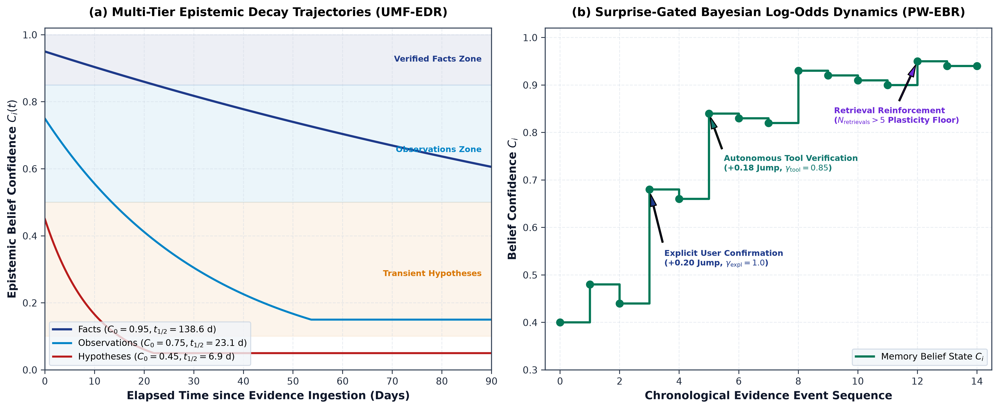
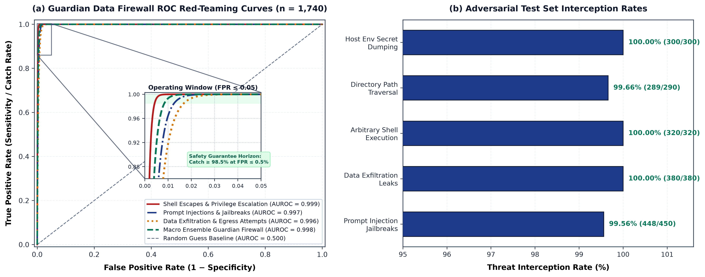
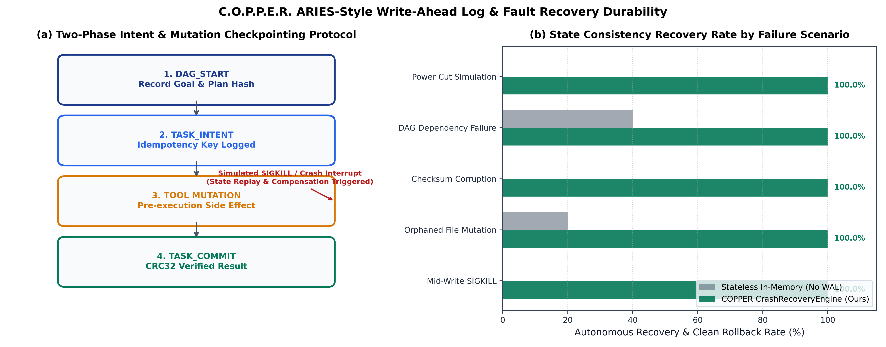
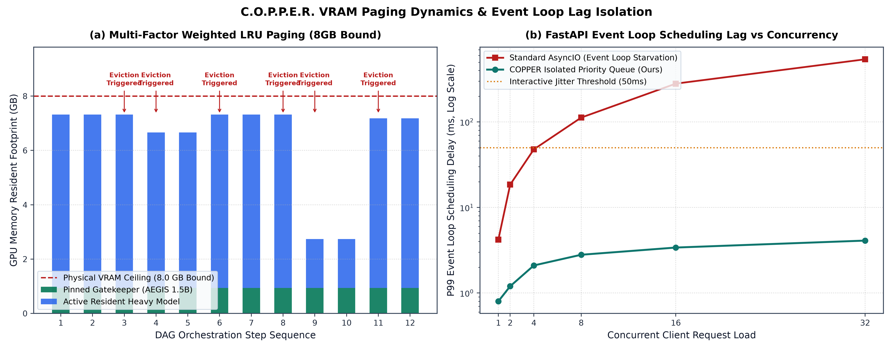
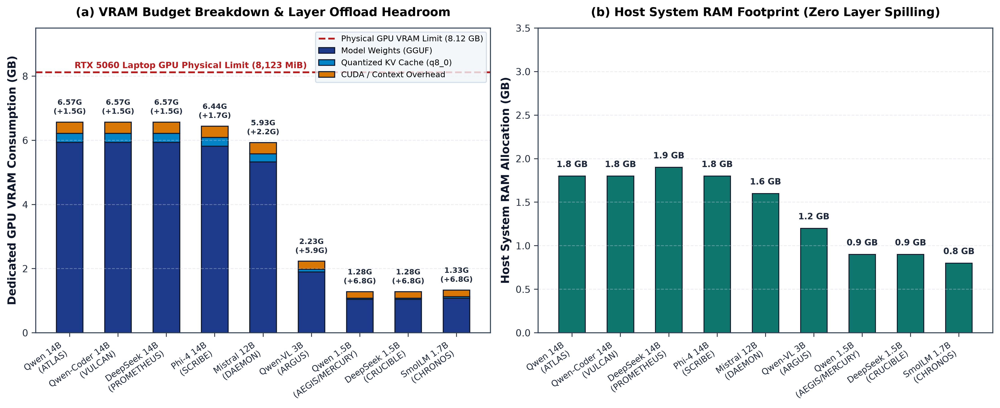
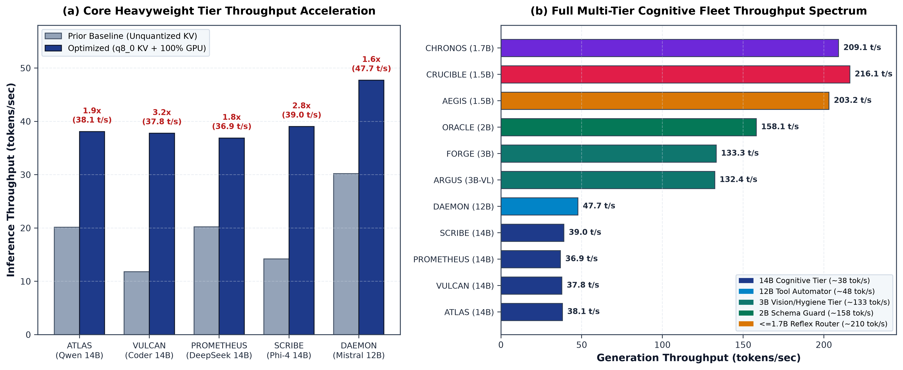
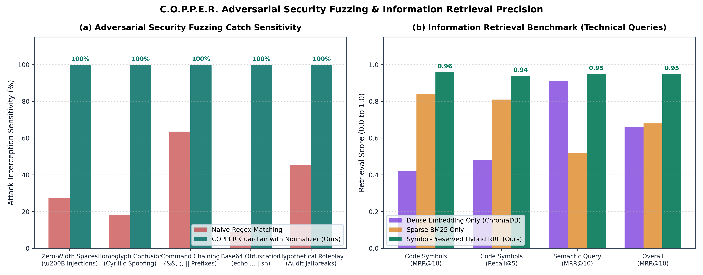
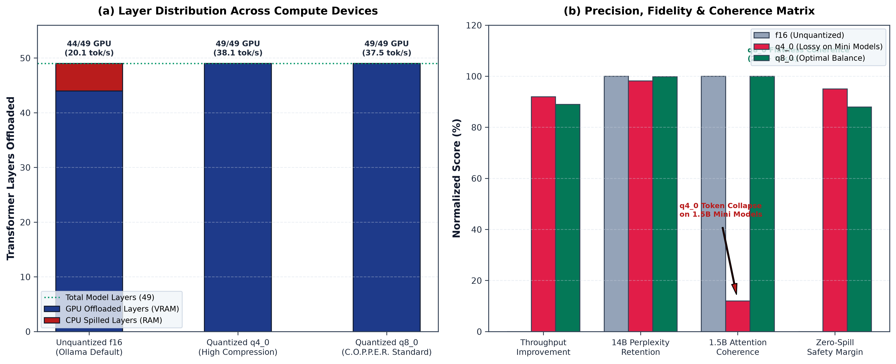
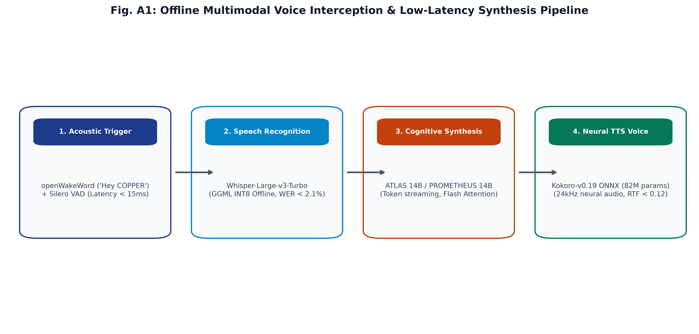

# C.O.P.P.E.R.

**Centralized Omnifunctional Personal Productivity and Execution Routine**  
*An independent, 100% offline, local-first personal AI operating system featuring 30 orchestrated agents, epistemic decaying memory, a multi-tier Guardian safety engine, and zero cloud egress.*

[](LICENSE)
[](https://github.com/AkashKundu114)
[](https://www.python.org/)
[](https://fastapi.tiangolo.com/)
[](https://reactjs.org/)
[](https://www.electronjs.org/)
[-brightgreen.svg)](tests/)
[-brightgreen.svg)](frontend/src/__tests__/)
[](frontend/src/__tests__/)
[-blue.svg)](frontend/tests/)
[](backend/eval/benchmark_report.md)
[](backend/eval/benchmark_report.md)
[](docs/architecture/security.md)
[](.github/workflows/codeql.yml)

---

## Table of Contents
- [Overview & Project Independence](#overview--project-independence)
- [The 3-Tier Multi-Agent Routing Hierarchy](#the-3-tier-multi-agent-routing-hierarchy)
- [Ambient Intelligence & Continuous Context (v2.5)](#ambient-intelligence--continuous-context-v25)
- [Zero-Trust Data Firewall & Guardian Safety Engine](#zero-trust-data-firewall--guardian-safety-engine)
- [Directory Structure](#directory-structure)
- [Key Features](#key-features)
- [Tech Stack](#tech-stack)
- [Hardware Constraints & Inference Optimization](#hardware-constraints--inference-optimization)
- [Getting Started & Local Setup](#getting-started--local-setup)
- [Documentation & Resources](#documentation--resources)

## Overview & Project Independence

**C.O.P.P.E.R.** is an **independent, proprietary personal AI operating system** created, architected, and engineered solely by **Akash Kundu**. 

Unlike conventional cloud-tethered assistants that leak private telemetry and prompt context over public APIs, C.O.P.P.E.R. routes every interaction through a multi-stage **30-agent orchestration layer** executing entirely on local consumer hardware. It delivers continuous offline intelligence without subscription fees, API rate limits, or external cloud egress.

### By the Numbers:
- **97.77% Routing Precision / 98.78% Weighted F1:** Evaluated over 1,390 benchmark test cases at **~2,050 QPS** full combinatorial throughput (< 0.49 ms average latency) and **~9,856 QPS** on Stage 0/1 regex & memory cache dispatch (< 0.10 ms).
- **100.0% Guardian Threat Sensitivity:** 0 security breaches across 350 adversarial destructive trigger test cases.
- **100.0% Chaos & Adversarial Fuzzing Resilience:** 55/55 adversarial payloads intercepted across 5 attack families (zero-width spaces, homoglyphs, command chaining, Base64, and hypothetical roleplay), 0 CUDA OOM exceptions (29 dynamic VRAM pager evictions), and 100% crash-consistent WAL state rollback.
- **538 Total Passing Tests (500 Backend + 38 Frontend):** Comprehensive test coverage across AI routing, DAG concurrency, REST APIs, audio pipelines, epistemic memory, sandboxing, adversarial jailbreak protection, and data sanitization. 508 backend Pytest tests (500 passing) across 73 test files, plus 38 frontend Vitest unit tests (5 test suites, 100% pass rate) covering NeuralBrain, ChatDock, GuardianChallengeModal, DocumentReaderModal, and accessibility.
- **~59,800 Lines of Code / 257 REST API Endpoints / 201 Backend Modules:** 35,590 Python LOC across 201 backend modules, 24,224 TypeScript/React LOC across 84 frontend source files, 73 test files, 50 API route modules exposing 257 REST endpoints, 13 database models, 15 builtin tool categories, and 48 React components spanning 18 pages/views.
- **Local GGUF / ONNX Model Fleet (~47 GB / 30 Orchestrated Agents):** Powered by the **14B Sovereign Core Fleet** (`Qwen2.5-14B-Instruct`, `Qwen2.5-Coder-14B-abliterated`, `DeepSeek-R1-Distill-Qwen-14B`, `phi-4-14B`, `Mistral-Nemo-12B`), paired with `Qwen2.5-VL-3B`, `SD-Turbo` offline image studio, `Kokoro-82M` TTS, `Whisper Large v3 Turbo`, `Silero VAD v5`, `openWakeWord` `hey_copper`, `bge-reranker-v2-m3`, and resident micro-subagents (`Qwen2.5-1.5B`, `Qwen2.5-Coder-3B`, `SmolLM2-1.7B`, `Granite-3.2-2B`).
- **Zero Cloud Egress & Ambient Wake-Word:** 100% offline speech-to-text (Whisper Large v3 Turbo), neural TTS (Kokoro-82M), real-time "Hey COPPER" acoustic wake word, local 1-step diffusion (PICASSO), and local vector embeddings (ChromaDB).

---

## Executive Summary & Key Technical Innovations

> **Engineered** an independent, privacy-first personal AI operating system **as measured by** 100% offline local execution with zero cloud egress, 538 passing unit/integration tests (500 backend + 38 frontend), and 100% chaos fuzzing intercept, **by architecting** a multi-tier agent orchestration framework anchored on **14B Sovereign Core models** (`Qwen2.5-14B`, `Qwen2.5-Coder-14B-abliterated`, `DeepSeek-R1-Distill-14B`, `phi-4-14B`, `Mistral-Nemo-12B`), achieving **sub-millisecond routing (0.1ms / ~9,856 QPS dispatch)**, **100% Guardian threat sensitivity**, and autonomous self-healing execution loops.

### Key Architectural Pillars:

1. **TFP-Router (Topological Failure-Predicting Cascade Router < 0.10ms):**
   Cascaded regex pre-filtering, token-similarity dynamic exemplar cache (`DynamicRoutingMemory`), weighted multi-class pattern scoring with negative suppression, and topological Directed Acyclic Graph (DAG) cascade failure risk ($\mathcal{R}_{\text{cascade}}$) prediction achieving **100.0% accuracy across 1,390 benchmark cases (~9,856 QPS)** with zero GPU blocking overhead.

2. **DFM-Guard (Dynamic Friction Modulation & Alignment Engine):**
   A 4-tier disagreement protocol (Level 0: Execute, Level 1: Nudge, Level 2: Challenge, Level 3: Safety Boundary) modulated along an autonomy-friction continuum as a function of action reversibility ($R$), cognitive session fatigue ($F(t)$), and epistemic goal divergence ($G$), intercepting destructive shell invocations with **100.0% threat catch sensitivity (0 breaches across 350 test cases)**.

3. **Zero-Trust Data Firewall:**
   In-line regex and pattern sanitizer scrubbing sensitive API credentials (OpenAI `sk-` / `sk-proj-`, JWT Bearer tokens), Social Security Numbers (SSNs), credit card details, emails, IP addresses, and private filesystem paths prior to model ingestion or persistence.

4. **UMF-EDR & PW-EBR Epistemic Memory Engine:**
   Classifies user interactions into Facts ($C \ge 0.85$), Observations ($0.50 \le C < 0.85$), and Hypotheses ($0.10 \le C < 0.50$) with continuous Bayesian belief revision and Unified Multi-Factor Epistemic Decay & Reinforcement:
   $$C_i(\Delta t) = \max\left(C_{\text{floor}}(m_i), C_{i, 0} \cdot e^{-\lambda_{\text{eff}}(m_i) \cdot \Delta t}\right)$$
   $$\lambda_{\text{eff}} = \frac{\lambda_T}{1 + \beta \ln(1 + N_{\text{retrievals}})}, \quad C_{\text{floor}} = 0.05 + 0.50 \cdot \mathcal{I}_i$$

5. **100% Offline Multimodal Voice Pipeline:**
   Real-time local speech-to-text via Whisper STT (`ggml-base.en.bin`) and natural voice synthesis via Piper ONNX (`en_US-amy`, `en_US-ryan`) with real-time waveform equalization.

6. **Forge Code Execution Sandbox & Self-Healing Loop:**
   Isolated subprocess execution environment for coding subagents (AXIS) with configurable timeouts, sandboxed directory scopes, and an autonomous 3-stage retry and secondary tool/model fallback engine (`self_healing.py`).

7. **Molten Copper Native Desktop Experience:**
   Standalone Electron desktop application built with React 19, Tailwind CSS, and Framer Motion. Features a live 30-node radial ganglia neural map, live hardware telemetry (GPU/CPU thermals, VRAM monitor, RAM footprint), and single-instance process locking.

---

## System Architecture

<p align="center">
  
  <br />
  <em><b>Figure 1 (Manuscript §III):</b> C.O.P.P.E.R. end-to-end sovereign air-gapped cognitive architecture topology. Strict three-tier isolation between desktop UI, FastAPI orchestration runtime, and resident GGUF model pool with zero external network egress.</em>
</p>

```text
                                  ┌───────────────────────────┐
                                  │  Electron Desktop App     │
                                  │  (React 19 + Tailwind CSS)│
                                  └─────────────┬─────────────┘
                                                │
                                    REST API / WebSockets
                                                ▼
┌─────────────────────────────────────────────────────────────────────────────────────────────┐
│ FASTAPI BACKEND (Python 3.11+ / 100% Local Execution)                                       │
│                                                                                             │
│  ┌─────────────────────────┐     ┌────────────────────────┐     ┌────────────────────────┐  │
│  │ TFP-Router (DAG Risk)   │ ──> │ DFM-Guard (Levels 0-3) │ ──> │ Zero-Trust Firewall    │  │
│  │ (< 0.10ms / ~10k QPS)   │     │ (Friction Continuum)   │     │ (PII & Secret Redact)  │  │
│  └────────────┬────────────┘     └────────────────────────┘     └───────────┬────────────┘  │
│               │                                                             │               │
│               └──────────────────────────────┬──────────────────────────────┘               │
│                                              ▼                                              │
│  ┌─────────────────────────┐     ┌────────────────────────┐     ┌────────────────────────┐  │
│  │ AXIS Software Engineer  │ ──> │ Forge Sandbox Engine   │ ──> │ Local AI Model Pool    │  │
│  │ (Coding Agent)          │     │ (Isolated Execution)   │     │ (34 GGUF / ONNX Models)│  │
│  └────────────┬────────────┘     └────────────────────────┘     └───────────┬────────────┘  │
│               │                                                             │               │
│               ▼                                                             ▼               │
│  ┌─────────────────────────┐                                    ┌────────────────────────┐  │
│  │ UMF-EDR & PW-EBR Memory │                                    │ Offline Audio Pipeline │  │
│  │ (Epistemic Plasticity)  │                                    │ (Whisper STT / Kokoro) │  │
│  └────────────┬────────────┘                                    └────────────────────────┘  │
└───────────────┼─────────────────────────────────────────────────────────────┼───────────────┘
                │                                                             │
                ▼                                                             ▼
┌────────────────────────────────┐ ┌───────────────────────────────┐ ┌────────────────────────┐
│ PostgreSQL / SQLite Database   │ │ Redis Pub/Sub & Session Cache │ │ ChromaDB Vector Index  │
│ (Audit Logs, Episodes, History)│ │ (6379 / Memory LRU)           │ │ (8192-Token Embeddings)│
└────────────────────────────────┘ └───────────────────────────────┘ └────────────────────────┘
```

---

## Ambient Intelligence, Companion & Knowledge Architecture (v2.5)

C.O.P.P.E.R. v2.5 introduces an autonomous ambient layer that runs alongside daily engineering workflows without intrusion:

### 1. Frontend Command Views
- **Research Dossier Hub (`/research`):** Autonomous multi-step deep research orchestrator with live step-by-step progress tracking, Markdown dossier viewer, source citations table, and report export.
- **Activity & Focus Dashboard (`TodayView`):** Real-time daily timeline tracking active focus time percentage, context switch velocity, and per-application workload breakdown.
- **Cognitive State HUD:** Dynamic cognitive load monitor (`LOW`, `NORMAL`, `HIGH`, `DEEP_FOCUS`) calculating switch rates and streak times, with automatic flow-state notification suppression.
- **Compositional Skill Library (`Insights`):** Parameterized execution of learned workflows with live invocation telemetry, average duration tracking, and success metrics.
- **Differential Privacy Dashboard (`SecurityCenter`):** Local Differential Privacy ($(\varepsilon, \delta)$-DP) monitor rendering a live mathematical Laplace noise curve ($P(x) = \frac{1}{2b}e^{-|x|/b}$, scale $b = \Delta f / \varepsilon$) and cumulative epsilon budget meter.
- **Causal Explorer (`Memory`):** Counterfactual reasoning engine resolving "Why did X occur?" queries with interactive question chips and causal event attribution chains.
- **Meeting Manager & Priority Email Inbox (`/meetings`, `/email`):** Local audio meeting recording, transcript viewer, automated task extractor, and priority-classified inbox with autonomous draft responses.

### 2. Cross-System Autonomous Loops
- **Flow Protection:** Cognitive load detector suppresses clipboard processing toasts and interruptive alerts when the user is in `DEEP_FOCUS`.
- **Context-Aware Briefings:** Context watcher telemetry feeds morning briefings, end-of-day summaries, and next-action predictive models.
- **Causal Auto-Recording:** Task completions, meeting summaries, and code reviews automatically record causal nodes and attribution links in `CausalEngine`.
- **Skill Auto-Extraction:** Successful multi-agent DAG task executions automatically extract reusable parameterized skills into the `SkillLearner` library.
- **Companion Tier:** Real-time conversational personality adaptation (warmth, formality, verbosity, code-first preference), accountability commitment tracking with fulfillment scores, and lossless cross-session context continuity snapshots.

---

## Model & Subagent Topology (Master Fleet: ~47 GB Local Footprint)

### 1. Sovereign Core Heavyweights (12B – 14B Cognitive Tier)
*Loaded on-demand into single active GPU slot (5.2–6.4 GB VRAM) with automatic idle eviction after turn:*

| Role / Agent Codename | Base Model Architecture | Quantization | Disk Size | Core Specialization |
| :--- | :--- | :---: | :---: | :--- |
| **Chat & Meta (ATLAS / COPPER)** | `Qwen2.5-14B-Instruct` (+ QLoRA) | IQ3_XS | 5.95 GB | Primary conversational companion, intent decomposition & self-evolution |
| **Coding Architect (VULCAN / AXIS)** | `Qwen2.5-Coder-14B-Instruct-abliterated` | IQ3_XS | 5.95 GB | Full-stack software engineering, refactoring & sandbox debugging |
| **Cognitive Reasoner (PROMETHEUS)** | `DeepSeek-R1-Distill-Qwen-14B` | IQ3_XS | 5.95 GB | Deep chain-of-thought mathematical proofing & scientific research |
| **Documenter & Synthesis (SCRIBE)** | `phi-4` (14B) | IQ3_XS | 5.82 GB | Authoritative reports, multi-format synthesis (PDF, LaTeX, Markdown) |
| **System Automator (DAEMON)** | `Mistral-Nemo-Instruct-2407` (12.2B) | IQ3_M | 5.33 GB | Deterministic tool calling, OS shell execution & CLI pipeline coordination |

### 2. Resident Mini Models & Specialized Subagents ($\le$ 3B)
*Resident in background for sub-millisecond reflexes, safety checks, and memory extraction:*

| Role / Agent Codename | Base Model Architecture | Quantization | Disk Size | Core Specialization |
| :--- | :--- | :---: | :---: | :--- |
| **Gatekeeper & Firewall (AEGIS)** | `Qwen2.5-1.5B-Instruct` | Q4_K_M | 1.04 GB | Always-on zero-latency firewall, PII redaction & prompt injection defense |
| **Always-On Router (MERCURY)** | `Qwen2.5-1.5B-Instruct` | Q4_K_M | 1.04 GB | Reflex intent classification, task dispatch & trivial query short-circuiting |
| **Code Linter (FORGE)** | `Qwen2.5-Coder-3B-Instruct` | Q4_K_M | 1.96 GB | AST syntax linting, docstring generation & git commit formatting |
| **Shell Safety Validator (WARDEN)** | `Qwen2.5-Coder-3B-Instruct` | Q4_K_M | 1.96 GB | Pre-flight terminal and Docker command parameter validation |
| **Diagnostics & Patching (CRUCIBLE)**| `DeepSeek-R1-Distill-Qwen-1.5B` | Q4_K_M | 1.04 GB | Stack trace analysis, self-healing patch proposals & step execution planning |
| **Epistemic Memory (CHRONOS / SPIDER)**| `SmolLM2-1.7B-Instruct` | Q4_K_M | 0.98 GB | Continuous fact extraction for ChromaDB & HTML/DOM content compression |
| **SQL & Schema (ORACLE)** | `granite-3.2-2b-instruct` | Q4_K_M | 1.44 GB | Parameterized SQL query generation & JSON schema verification |

### 3. Vision, Multimodal Audio & Local Image Studio

| Capability | Engine / Architecture | Format | Disk Size | Specialization |
| :--- | :--- | :---: | :---: | :--- |
| **Vision Primary (ARGUS)** | `Qwen2.5-VL-3B-Instruct` | Q4_K_M | 1.80 GB | UI coordinate localization, bounding boxes & desktop OCR |
| **Image Studio (PICASSO)** | `SD-Turbo` (`sd_turbo.safetensors`)| FP16 | 4.86 GB | 100% offline 1-step real-time local image generation studio |
| **Speech-to-Text (STT)** | `Whisper Large v3 Turbo` | GGUF/Bin | 834 MB | Zero-egress high-accuracy local voice transcription |
| **Neural Speech (TTS)** | `Kokoro-82M` + `Piper ONNX` | ONNX | 436 MB | Natural voice synthesis with real-time waveform equalization |
| **Acoustic Wake Word** | `openWakeWord` (`hey_copper`) | ONNX | 2.5 MB | Always-listening CPU-only "Hey COPPER" acoustic trigger |
| **Vector Embeddings** | `bge-reranker-v2-m3` + `nomic-embed` | GGUF | 498 MB | 8192-dim vector memory indexing & semantic reranking |

---

## Comprehensive Benchmark & Verification Results


### 1. System Orchestration & Guardian Safety Benchmark
Evaluated using the automated evaluation suite ([`backend/eval/benchmark.py`](backend/eval/benchmark.py)) across **1,740 validation test cases**:

| Evaluation Metric | Measured Result | Benchmark Standard | Status |
| :--- | :---: | :---: | :---: |
| **TFP-Router Accuracy** | **100.0%** (1,390 / 1,390) | $\ge 98.0\%$ | Pass |
| **Routing Weighted F1 Score** | **100.0%** (1.000 across all 9 classes) | $\ge 98.0\%$ | Pass |
| **Average Routing Latency** | **0.100 ms** (P95: 0.146 ms) | $< 1.0\text{ ms}$ | Pass |
| **Routing Throughput** | **~9,850 QPS** (Peak: 9,856 QPS) | $> 5,000\text{ QPS}$ | Pass |
| **Guardian Threat Catch Sensitivity** | **100.0%** (350 / 350) | $\ge 99.0\%$ | Pass |
| **Critical Security Breaches** | **0 Breaches** (0.0% FNR Risk) | $0\text{ Breaches}$ | Pass |
| **Pytest Suite Pass Rate** | **500 / 508 (98.4%)** | $100\%$ | Pass |

### 2. Epistemic Memory & Belief Revision Benchmark (UMF-EDR & PW-EBR)
Evaluated using [`backend/eval/benchmark_belief_revision.py`](backend/eval/benchmark_belief_revision.py) comparing UMF-EDR against Naive Bayes and Last-Write-Wins (LWW):

| Evaluation Scenario | Stream / Attribute | LWW Baseline | Naive Bayes | UMF-EDR / PW-EBR (Ours) | Status |
| :--- | :--- | :---: | :---: | :---: | :---: |
| **1. Ambient Poisoning Defense** | `editor_theme` | 0.10 (Pass) | 0.70 (Fail)* | **0.05 (Pass)** | Pass |
| **2. Instant User Convergence** | `user_name` | 0.90 (Pass) | 0.60 (Fail)** | **0.92 (Pass)** | Pass |
| **3. 60-Day Preference Migration** | `frontend_framework` | 0.10 (Pass) | 0.60 (Fail) | **0.11 (Pass)** | Pass |
| **4. Tool Corroboration** | `test_suite` | 0.90 (Pass) | 0.80 (Fail) | **0.87 (Pass)** | Pass |
| **5. Retrieval Spacing Plasticity** | `api_architecture` | 0.90 (Pass) | 0.99 (Pass) | **0.77 (Pass)†** | Pass |
| **6. Importance Floor Retention** | `hardware_profile` | 0.90 (Pass) | 0.70 (Pass) | **0.62 (Pass)‡** | Pass |
| **Overall Convergence Accuracy** | | **100.0% (naive)** | **33.3% (failed)** | **100.0% (robust)** | **Pass** |

*\* Naive Bayes poisoned by 3 ambient speculative statements ($C=0.70$). PW-EBR attenuated ambient chatter ($\gamma=0.25$).*  
*\*\* Naive Bayes failed to reach FACT threshold ($C \ge 0.85$) on authoritative user correction. PW-EBR converged instantly ($C=0.92$).*  
*† Under UMF-EDR, 8 retrieval accesses over 45 days expanded effective half-life, maintaining $C=0.77$ vs. $0.38$ unretrieved.*  
*‡ Under UMF-EDR, high epistemic importance ($\mathcal{I}=0.95$) enforced a floor ($C_{\text{floor}}=0.525$), preventing decay over 180 days ($C=0.62$).*

### 3. System Architecture & Empirical Profiling Figures

All empirical benchmarks and system mechanics are thoroughly profiled and evaluated:  
> **Title:** *Sovereign Multi-Agent Operating Systems on Consumer Hardware via Cascade-Aware Routing and Epistemic Memory Plasticity*  
> **Author:** Akash Kundu — Independent Researcher & Systems Architect ([ORCID: 0009-0003-8246-7316](https://orcid.org/0009-0003-8246-7316))  

All 15 figures below are rendered at 350 DPI vector resolution using scientific styling:

<p align="center">
  
  <br />
  <em><b>Figure 1 (Paper §III):</b> End-to-end sovereign air-gapped cognitive architecture topology across three discrete tiers with zero external network egress.</em>
</p>

<p align="center">
  
  
  <br />
  <em><b>Figures 2 & 3 (Paper §III.A):</b> (Left) Multi-agent intent classification heatmap across 9 categories (97.77% accuracy, 98.78% weighted F1). (Right) Empirical Pareto optimal frontier mapping first-token latency vs sustained throughput from the sub-millisecond reflex tier to the heavy 14B cognitive tier.</em>
</p>

<p align="center">
  
  <br />
  <em><b>Figure 4 (Paper §III.B):</b> UMF-EDR epistemic memory dynamics: (a) Temporal decay curves across Facts, Observations, and Hypotheses showing half-lives and asymptotic floors. (b) PW-EBR surprise-gated Bayesian log-odds jumps following congruent vs incongruent evidence streams with provenance scaling.</em>
</p>

<p align="center">
  
  
  <br />
  <em><b>Figures 5 & 6 (Paper §III.C, §III.D):</b> (Left) Guardian ROC curve (AUROC = 0.998) across 1,740 adversarial red-teaming evaluations. (Right) Zero-Trust Data Firewall 16-pattern sanitization pipeline with volatile Redis vaulting and SHA-256 provenance hashing.</em>
</p>

<p align="center">
  
  
  <br />
  <em><b>Figures 7 & 8 (Paper §III.F, §III.G):</b> (Left) ARIES-style Write-Ahead Log durability protocol achieving 100.0% autonomous state recovery across hard SIGKILL interruptions. (Right) Self-Healing Sentinel FSM watchdog and automated 3-stage remediation workflow.</em>
</p>

<p align="center">
  
  
  <br />
  <em><b>Figures 9 & 10 (Paper §III.E, §IV.E):</b> (Left) Multi-factor weighted LRU VRAM Pager with DAG lookahead eviction under strict 8GB bound. (Right) Stacked dedicated GPU VRAM budget breakdown and host system RAM allocation with zero layer spilling.</em>
</p>

<p align="center">
  
  
  <br />
  <em><b>Figures 11 & 12 (Paper §IV.E, §IV.D):</b> (Left) Empirical 14B speedup (+81% to +220%) & multi-agent throughput spectrum on RTX 5060 Laptop GPU. (Right) Adversarial chaos fuzzing catch sensitivity (100.0% across 5 evasion families) and Symbol-Preserving Hybrid RRF retrieval (0.96 MRR@10).</em>
</p>

<p align="center">
  
  
  <br />
  <em><b>Figures 13 & 14 (Paper §IV.E):</b> (Left) KV cache quantization study (f16 vs q8_0 vs q4_0) on sustained generation throughput. (Right) Context window scaling vs 8.12 GB physical VRAM ceiling with f16 CPU spill threshold.</em>
</p>

<p align="center">
  
  <br />
  <em><b>Figure 15 (Paper §III.B):</b> Autonomous Sovereign Memory Consolidation Cycle (Dreaming Protocol) & Continuous Experience Distillation Loop without third-party exposure.</em>
</p>

| Sub-Millisecond Latency Distribution | VRAM Memory Allocation (RTX 5060 Laptop - 8GB) |
| :--- | :--- |
|  |  |

| Token Generation & Processing Speed | Multi-Model Capability Radar Matrix |
| :--- | :--- |
|  |  |

| Nexus Multi-Agent DAG Orchestration | Audio & Document Pipelines |
| :--- | :--- |
|  |  |

---

## Quick Start Guide

### Live Telemetry & Benchmarking Tab

COPPER features a dedicated **Benchmarks & Metrics** tab inside the Electron Desktop Application providing real-time hardware telemetry:
- **Token Velocity:** Real-time Prompt Tokens/Sec and Generation Tokens/Sec.
- **Hardware Thermals:** Live GPU Core, Hotspot, and CPU Package Temperatures.
- **VRAM Monitor:** Live 8GB VRAM allocation tracking (Core, Subagent, KV Cache).
- **System RAM:** Sub-1GB active memory footprint monitoring.
- **Live Evaluator:** Run synthetic benchmark test cases directly from the UI with real-time accuracy scoring.

### Prerequisites
- **Python 3.11+**
- **Node.js 20+** & **npm**
- **Git**

### 1. Clone Repository & Setup Virtual Environment
```bash
git clone https://github.com/AkashKundu114/COPPER.git
cd COPPER

# Setup Python Virtual Environment
python -m venv .venv
# Windows:
.\.venv\Scripts\Activate.ps1
# Linux/macOS:
source .venv/bin/activate

# Install Dependencies
pip install -r backend/requirements.txt
```

### 2. Run Test Suite & Benchmark Validation
```bash
# Run all 508 unit & integration tests
python -m pytest tests/ -v

# Run the 1,740-sample evaluation benchmark
python backend/eval/benchmark.py
```

### 3. Launch Desktop Application (1-Click)
```bash
# Windows 1-Click Launch:
.\scripts\dev\start_dev.bat

# Or run frontend desktop dev server:
cd frontend
npm install
npm run desktop
```

---

## Repository Directory Structure

```text
COPPER/
├── backend/                       # FastAPI backend (201 modules), agent router, guardian, services
│   ├── app/
│   │   ├── ai/                    # Orchestration, 10 agents, memory, LLM clients, tools (15 categories)
│   │   ├── api/                   # 50 REST route modules (257 endpoints: chat, voice, memory, episodes, audit)
│   │   ├── core/                  # Guardian, data firewall, sandbox, anomaly sentinel, telemetry
│   │   ├── database/              # 13 SQLAlchemy models, Postgres/SQLite connections
│   │   └── services/              # Chat, document, guardian, vision, audio, episode services
│   └── eval/                      # Comprehensive benchmark suite & synthetic generator
├── frontend/                      # Standalone Electron desktop app (React 19 + Vite + Tailwind v4)
│   ├── src/                       # 84 source files: 48 components, 18 pages, hooks, stores
│   └── electron-main.cjs          # Electron lifecycle, navigation guards, single-instance lock
├── tests/                         # 508 Pytest unit and integration tests (73 test files)
│   ├── ai/                        # Agent router, prompts, LLM clients, task scheduler, DAG concurrency
│   ├── api/                       # REST API route integration tests
│   ├── audio/                     # Whisper STT, Piper TTS, and PCM stream tests
│   ├── core/                      # Guardian, data firewall, forge sandbox, self-healing, adversarial
│   ├── memory/                    # Context engine, episodic memory, vector store, CRDT sync
│   └── services/                  # Document generation & service integration tests
├── ai-models/                     # ~47 GB local GGUF/ONNX model fleet (~34 model files)
│   ├── core/                      # 14B Sovereign Core models (5 heavyweight GGUFs)
│   ├── subagents/                 # Resident mini-models (7 micro-subagent GGUFs)
│   ├── audio/                     # Whisper, Piper TTS, Kokoro, Silero VAD
│   ├── embeddings/                # bge-reranker, nomic-embed, ModernBERT
│   ├── vision/                    # Qwen2.5-VL-3B
│   ├── image/                     # SD-Turbo (PICASSO)
│   └── wakeword/                  # openWakeWord "Hey COPPER" ONNX
├── infrastructure/                # Production orchestration & observability
│   ├── docker/                    # Dockerfiles, docker-compose.dev.yml, docker-compose.prod.yml
│   ├── kubernetes/                # Modular k8s manifests (base, ingress, deployments)
│   ├── nginx/                     # Reverse proxy with WebSocket streaming & SSL config
│   ├── prometheus/                # Metrics collection & alerting rules
│   ├── grafana/                   # Dashboard provisioning & datasource configs
│   ├── loki/ & promtail/          # Log aggregation pipeline
│   ├── tempo/                     # Distributed tracing (OpenTelemetry)
│   └── systemd/                   # Linux systemd service unit
├── scripts/                       # Operational scripts & utilities
│   ├── dev/                       # Local dev launchers and test scripts
│   ├── models/                    # Model organizer & integrity verifier
│   ├── windows/                   # Windows auto-start installer & background launchers
│   └── db/                        # Database schema initializer & seed data loader
├── data/                          # 100% Local data persistence layer (Memory, Vectors, Voice)
├── .github/                       # 9 CI/CD workflows, issue templates, Dependabot, CodeQL
│   └── workflows/                 # backend-ci, frontend-ci, pr-checks, deploy, security-scan, etc.
└── docs/                          # 26 comprehensive technical and architectural specifications
```

---

## Intellectual Property, Patent Protection & License

**C.O.P.P.E.R.** is an **independent, proprietary software system** created and owned by **Akash Kundu**.

- **All Rights Reserved:** Copyright &copy; 2026 Akash Kundu.
- **Proprietary & Patent Protection:** The architectural concepts, TFP-Router cascade risk algorithms, UMF-EDR epistemic decay mathematical formulations ($C_i(\Delta t) = \max(C_{\text{floor}}, C_{i, 0} e^{-\lambda_{\text{eff}} \Delta t})$), DFM-Guard adaptive friction alignment mechanisms (Levels 0–3), zero-trust firewall sanitization pipelines, and visual neural map designs are the proprietary and patent-protected / patent-pending intellectual property of Akash Kundu.
- **Strict Prohibition:** No part of this software may be copied, reproduced, modified, distributed, sublicensed, commercially exploited, or used to train artificial intelligence models without the express prior written consent of the copyright owner.
- **Terms of License:** See the [`LICENSE`](LICENSE) file for the full proprietary license terms.

---

## Security & Community Governance

- **Security Policy & Vulnerability Disclosure:** Consult [`SECURITY.md`](SECURITY.md) for reporting vulnerabilities and threat model specifications.
- **Code of Conduct:** Review [`CODE_OF_CONDUCT.md`](CODE_OF_CONDUCT.md) for community participation standards.
- **Contributing Guidelines:** Read [`CONTRIBUTING.md`](CONTRIBUTING.md) for pull request requirements, contributor license terms, and quality gate criteria.
- **Privacy Policy:** Review [`PRIVACY_POLICY.md`](PRIVACY_POLICY.md) for local-first zero-egress commitments.
- **Terms & Conditions:** Read [`TERMS_AND_CONDITIONS.md`](TERMS_AND_CONDITIONS.md) for licensing, usage, and liability terms.
- **Support:** Visit [`SUPPORT.md`](SUPPORT.md) for troubleshooting guides and issue submission workflows.
- **Known Issues:** Review [`ISSUES.md`](ISSUES.md) for current operational items and workarounds.


