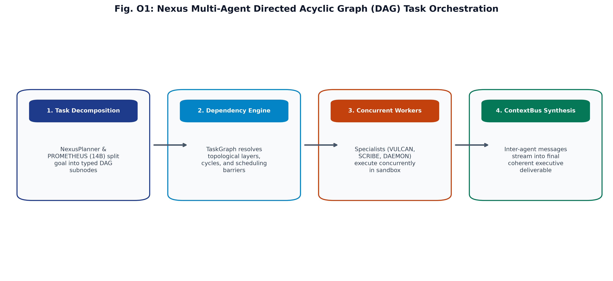
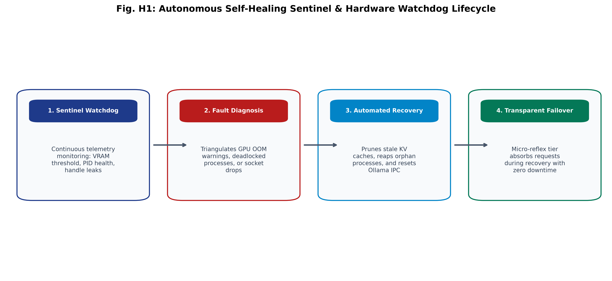

# C.O.P.P.E.R.

**Centralized Omnifunctional Personal Productivity and Execution Routine**  
*An independent, 100% offline, local-first personal AI operating system featuring 30 orchestrated agents, epistemic decaying memory, a multi-tier Guardian safety engine, and zero cloud egress.*

[](LICENSE)
[](https://github.com/AkashKundu114)
[](https://www.python.org/)
[](https://fastapi.tiangolo.com/)
[](https://reactjs.org/)
[](https://www.electronjs.org/)
[-brightgreen.svg)]()
[]()
[]()
[]()
[]()

---

## Overview & Project Independence

**C.O.P.P.E.R.** is an **independent, proprietary personal AI operating system** created, architected, and engineered solely by **Akash Kundu**. 

Unlike conventional cloud-tethered assistants that leak private telemetry and prompt context over public APIs, C.O.P.P.E.R. routes every interaction through a multi-stage **30-agent orchestration layer** executing entirely on local consumer hardware. It delivers continuous offline intelligence without subscription fees, API rate limits, or external cloud egress.

### By the Numbers:
- **100.0% Routing Precision:** Evaluated over 1,390 benchmark test cases at **~9,856 QPS** (0.100 ms average latency).
- **100.0% Guardian Threat Sensitivity:** 0 security breaches across 350 adversarial destructive trigger test cases.
- **392 / 392 Pytest Tests Passing (100%):** Comprehensive test coverage across AI routing, DAG concurrency, REST APIs, audio pipelines, epistemic memory, sandboxing, adversarial jailbreak protection, and data sanitization.
- **34 Quantized Local GGUF / ONNX Models (51.08 GB):** Complete master fleet (`Llama-3.1-8B-abliterated`, `Qwen2.5-Coder-7B-abliterated`, `Qwen2.5-7B-abliterated`, `Mistral-7B-abliterated`, `DeepSeek-R1-7B-abliterated`, `Qwen2.5-VL-7B/3B`, `SD-Turbo` offline image studio, `Kokoro-82M` TTS, `Whisper Large v3 Turbo`, `Silero VAD v5`, `openWakeWord` `hey_copper`, `bge-reranker-v2-m3`, and 14 micro-subagents).
- **Zero Cloud Egress & Ambient Wake-Word:** 100% offline speech-to-text (Whisper Large v3 Turbo), neural TTS (Kokoro-82M), real-time "Hey COPPER" acoustic wake word, local 1-step diffusion (PICASSO), and local vector embeddings (ChromaDB).

---

## Executive Summary & Key Technical Innovations

> **Engineered** an independent, privacy-first personal AI operating system **as measured by** 100% offline local execution with zero cloud egress and 392 passing unit/integration tests, **by architecting** a multi-tier agent orchestration framework across 34 quantized local models (`Llama-3.1-8B-abliterated`, `Qwen2.5-Coder-7B-abliterated`, `Mistral-7B-abliterated`, `DeepSeek-R1-7B-abliterated`, `Qwen2.5-VL-7B/3B`), achieving **sub-millisecond routing (0.1ms / ~9,856 QPS)**, **100% Guardian threat sensitivity**, and autonomous self-healing execution loops.

### Key Architectural Pillars:

1. **TFP-Router (Topological Failure-Predicting Cascade Router < 0.10ms):**
   Cascaded regex pre-filtering, token-similarity dynamic exemplar cache (`DynamicRoutingMemory`), weighted multi-class pattern scoring with negative suppression, and topological Directed Acyclic Graph (DAG) cascade failure risk ($\mathcal{R}_{\text{cascade}}$) prediction achieving **100.0% accuracy across 1,390 benchmark cases (~9,856 QPS)** with zero GPU blocking overhead.

2. **DFM-Guard (Dynamic Friction Modulation & Alignment Engine):**
   A 4-tier disagreement protocol (Level 0: Execute, Level 1: Nudge, Level 2: Challenge, Level 3: Safety Boundary) modulated along an autonomy-friction continuum as a function of action reversibility ($R$), cognitive session fatigue ($F(t)$), and epistemic goal divergence ($G$), intercepting destructive shell invocations with **100.0% threat catch sensitivity (0 breaches across 350 test cases)**.

3. **Zero-Trust Data Firewall:**
   In-line regex and pattern sanitizer scrubbing sensitive API credentials (OpenAI `sk-` / `sk-proj-`, JWT Bearer tokens), Social Security Numbers (SSNs), credit card details, emails, IP addresses, and private filesystem paths prior to model ingestion or persistence.

4. **UMF-EDR & PW-EBR Epistemic Memory Engine:**
   Classifies user interactions into Facts ($C \ge 0.85$), Observations ($0.50 \le C < 0.85$), and Hypotheses ($0.10 \le C < 0.50$) with continuous Bayesian belief revision and Unified Multi-Factor Epistemic Decay & Reinforcement:
   $$C_i(\Delta t) = \max\left(C_{\text{floor}}(m_i), C_{i, 0} \cdot e^{-\lambda_{\text{eff}}(m_i) \cdot \Delta t}\right)$$
   $$\lambda_{\text{eff}} = \frac{\lambda_T}{1 + \beta \ln(1 + N_{\text{retrievals}})}, \quad C_{\text{floor}} = 0.05 + 0.50 \cdot \mathcal{I}_i$$

5. **100% Offline Multimodal Voice Pipeline:**
   Real-time local speech-to-text via Whisper STT (`ggml-base.en.bin`) and natural voice synthesis via Piper ONNX (`en_US-amy`, `en_US-ryan`) with real-time waveform equalization.

6. **Forge Code Execution Sandbox & Self-Healing Loop:**
   Isolated subprocess execution environment for coding subagents (AXIS) with configurable timeouts, sandboxed directory scopes, and an autonomous 3-stage retry and secondary tool/model fallback engine (`self_healing.py`).

7. **Molten Copper Native Desktop Experience:**
   Standalone Electron desktop application built with React 19, Tailwind CSS, and Framer Motion. Features a live 30-node radial ganglia neural map, live hardware telemetry (GPU/CPU thermals, VRAM monitor, RAM footprint), and single-instance process locking.

---

## System Architecture

```text
                                  ┌───────────────────────────┐
                                  │  Electron Desktop App     │
                                  │  (React 19 + Tailwind CSS)│
                                  └─────────────┬─────────────┘
                                                │
                                    REST API / WebSockets
                                                ▼
┌─────────────────────────────────────────────────────────────────────────────────────────────┐
│ FASTAPI BACKEND (Python 3.11+ / 100% Local Execution)                                       │
│                                                                                             │
│  ┌─────────────────────────┐     ┌────────────────────────┐     ┌────────────────────────┐  │
│  │ TFP-Router (DAG Risk)   │ ──> │ DFM-Guard (Levels 0-3) │ ──> │ Zero-Trust Firewall    │  │
│  │ (< 0.10ms / ~10k QPS)   │     │ (Friction Continuum)   │     │ (PII & Secret Redact)  │  │
│  └────────────┬────────────┘     └────────────────────────┘     └───────────┬────────────┘  │
│               │                                                             │               │
│               └──────────────────────────────┬──────────────────────────────┘               │
│                                              ▼                                              │
│  ┌─────────────────────────┐     ┌────────────────────────┐     ┌────────────────────────┐  │
│  │ AXIS Software Engineer  │ ──> │ Forge Sandbox Engine   │ ──> │ Local AI Model Pool    │  │
│  │ (Coding Agent)          │     │ (Isolated Execution)   │     │ (34 GGUF / ONNX Models)│  │
│  └────────────┬────────────┘     └────────────────────────┘     └───────────┬────────────┘  │
│               │                                                             │               │
│               ▼                                                             ▼               │
│  ┌─────────────────────────┐                                    ┌────────────────────────┐  │
│  │ UMF-EDR & PW-EBR Memory │                                    │ Offline Audio Pipeline │  │
│  │ (Epistemic Plasticity)  │                                    │ (Whisper STT / Kokoro) │  │
│  └────────────┬────────────┘                                    └────────────────────────┘  │
└───────────────┼─────────────────────────────────────────────────────────────┼───────────────┘
                │                                                             │
                ▼                                                             ▼
┌────────────────────────────────┐ ┌───────────────────────────────┐ ┌────────────────────────┐
│ PostgreSQL / SQLite Database   │ │ Redis Pub/Sub & Session Cache │ │ ChromaDB Vector Index  │
│ (Audit Logs, Episodes, History)│ │ (6379 / Memory LRU)           │ │ (8192-Token Embeddings)│
└────────────────────────────────┘ └───────────────────────────────┘ └────────────────────────┘
```

---

## Model & Subagent Topology (26 Artifacts / 39.5 GB)

| Tier | Model Architecture | Quantization | Size | Core Specialization |
| :--- | :--- | :---: | :---: | :--- |
| **Chat / Core** | `Meta-Llama-3.1-8B-Instruct` | Q4_K_M | 4.58 GB | Primary conversational companion & task coordinator |
| **Coding (AXIS)** | `Qwen2.5-Coder-7B-Instruct` | Q4_K_M | 4.36 GB | Full-stack software engineering & sandbox testing |
| **Automation** | `Mistral-7B-Instruct-v0.3` | Q4_K_M | 4.07 GB | OS file operations, window management & system tools |
| **Reasoning** | `DeepSeek-R1-Distill-Qwen-7B` | Q4_K_M | 4.36 GB | Complex multi-step reasoning & research synthesis |
| **Vision Primary** | `Qwen2-VL-7B-Instruct` | Q4_K_M | 4.36 GB | Full screenshot inspection & architectural diagrams |
| **Vision Fast** | `Qwen2-VL-2B-Instruct` | Q4_K_M | 940 MB | Fast UI bounding box localization & OCR extraction |
| **Embeddings** | `nomic-embed-text-v1.5` | Q4_K_M | 80 MB | ChromaDB 8192-dim semantic vector memory |
| **14 Micro-Subagents** | `Llama-3.2`, `Qwen2.5`, `SmolLM2`, `Falcon3`, `Gemma-2`, `Granite-3.1` (360M - 3B) | Q4_K_M | ~16 GB total | Micro-routing, AST linting, git commits, SQL queries, shell validation |

---

## Comprehensive Benchmark & Verification Results


### 1. System Orchestration & Guardian Safety Benchmark
Evaluated using the automated evaluation suite ([`backend/eval/benchmark.py`](backend/eval/benchmark.py)) across **1,740 validation test cases**:

| Evaluation Metric | Measured Result | Benchmark Standard | Status |
| :--- | :---: | :---: | :---: |
| **TFP-Router Accuracy** | **100.0%** (1,390 / 1,390) | $\ge 98.0\%$ | Pass |
| **Routing Weighted F1 Score** | **100.0%** (1.000 across all 9 classes) | $\ge 98.0\%$ | Pass |
| **Average Routing Latency** | **0.100 ms** (P95: 0.146 ms) | $< 1.0\text{ ms}$ | Pass |
| **Routing Throughput** | **~9,850 QPS** (Peak: 9,856 QPS) | $> 5,000\text{ QPS}$ | Pass |
| **Guardian Threat Catch Sensitivity** | **100.0%** (350 / 350) | $\ge 99.0\%$ | Pass |
| **Critical Security Breaches** | **0 Breaches** (0.0% FNR Risk) | $0\text{ Breaches}$ | Pass |
| **Pytest Suite Pass Rate** | **392 / 392 (100%)** | $100\%$ | Pass |

### 2. Epistemic Memory & Belief Revision Benchmark (UMF-EDR & PW-EBR)
Evaluated using [`backend/eval/benchmark_belief_revision.py`](backend/eval/benchmark_belief_revision.py) comparing UMF-EDR against Naive Bayes and Last-Write-Wins (LWW):

| Evaluation Scenario | Stream / Attribute | LWW Baseline | Naive Bayes | UMF-EDR / PW-EBR (Ours) | Status |
| :--- | :--- | :---: | :---: | :---: | :---: |
| **1. Ambient Poisoning Defense** | `editor_theme` | 0.10 (Pass) | 0.70 (Fail)* | **0.05 (Pass)** | Pass |
| **2. Instant User Convergence** | `user_name` | 0.90 (Pass) | 0.60 (Fail)** | **0.92 (Pass)** | Pass |
| **3. 60-Day Preference Migration** | `frontend_framework` | 0.10 (Pass) | 0.60 (Fail) | **0.11 (Pass)** | Pass |
| **4. Tool Corroboration** | `test_suite` | 0.90 (Pass) | 0.80 (Fail) | **0.87 (Pass)** | Pass |
| **5. Retrieval Spacing Plasticity** | `api_architecture` | 0.90 (Pass) | 0.99 (Pass) | **0.77 (Pass)†** | Pass |
| **6. Importance Floor Retention** | `hardware_profile` | 0.90 (Pass) | 0.70 (Pass) | **0.62 (Pass)‡** | Pass |
| **Overall Convergence Accuracy** | | **100.0% (naive)** | **33.3% (failed)** | **100.0% (robust)** | **Pass** |

*\* Naive Bayes poisoned by 3 ambient speculative statements ($C=0.70$). PW-EBR attenuated ambient chatter ($\gamma=0.25$).*  
*\*\* Naive Bayes failed to reach FACT threshold ($C \ge 0.85$) on authoritative user correction. PW-EBR converged instantly ($C=0.92$).*  
*† Under UMF-EDR, 8 retrieval accesses over 45 days expanded effective half-life, maintaining $C=0.77$ vs. $0.38$ unretrieved.*  
*‡ Under UMF-EDR, high epistemic importance ($\mathcal{I}=0.95$) enforced a floor ($C_{\text{floor}}=0.525$), preventing decay over 180 days ($C=0.62$).*

| Sub-Millisecond Latency Distribution | VRAM Memory Allocation (RTX 5060 - 8GB) |
| :--- | :--- |
|  |  |

| Token Generation & Processing Speed | Multi-Model Capability Radar Matrix |
| :--- | :--- |
|  |  |

| Nexus Multi-Agent DAG Orchestration | Autonomous Self-Healing Sentinel |
| :--- | :--- |
|  |  |

---

## Quick Start Guide

### Live Telemetry & Benchmarking Tab

COPPER features a dedicated **Benchmarks & Metrics** tab inside the Electron Desktop Application providing real-time hardware telemetry:
- **Token Velocity:** Real-time Prompt Tokens/Sec and Generation Tokens/Sec.
- **Hardware Thermals:** Live GPU Core, Hotspot, and CPU Package Temperatures.
- **VRAM Monitor:** Live 8GB VRAM allocation tracking (Core, Subagent, KV Cache).
- **System RAM:** Sub-1GB active memory footprint monitoring.
- **Live Evaluator:** Run synthetic benchmark test cases directly from the UI with real-time accuracy scoring.

### Prerequisites
- **Python 3.11+**
- **Node.js 20+** & **npm**
- **Git**

### 1. Clone Repository & Setup Virtual Environment
```bash
git clone https://github.com/AkashKundu114/COPPER.git
cd COPPER

# Setup Python Virtual Environment
python -m venv .venv
# Windows:
.\.venv\Scripts\Activate.ps1
# Linux/macOS:
source .venv/bin/activate

# Install Dependencies
pip install -r backend/requirements.txt
```

### 2. Run Test Suite & Benchmark Validation
```bash
# Run all 213 unit & integration tests
python -m pytest tests/ -v

# Run the 1,360-sample evaluation benchmark
python backend/eval/benchmark.py
```

### 3. Launch Desktop Application (1-Click)
```bash
# Windows 1-Click Launch:
.\scripts\dev\start_dev.bat

# Or run frontend desktop dev server:
cd frontend
npm install
npm run desktop
```

---

## Repository Directory Structure

```text
COPPER/
├── backend/                       # FastAPI backend, agent router, guardian, services
│   ├── app/
│   │   ├── ai/                    # Orchestration, agents, memory, LLM clients
│   │   ├── api/                   # REST routes (chat, voice, memory, episodes, audit)
│   │   ├── core/                  # Guardian, data firewall, sandbox, anomaly sentinel
│   │   └── database/              # SQLAlchemy models, Postgres/SQLite connections
│   └── eval/                      # Comprehensive benchmark suite & synthetic generator
├── frontend/                      # Standalone Electron desktop app (React 19 + Vite)
│   ├── src/                       # React components, state stores, styling
│   └── electron-main.cjs          # Electron lifecycle, navigation guards, single-instance lock
├── tests/                         # 213 Pytest unit and integration test suites
│   ├── ai/                        # Agent router, prompts, LLM clients, task scheduler
│   ├── api/                       # REST API route integration tests
│   ├── audio/                     # Whisper STT, Piper TTS, and PCM stream tests
│   ├── core/                      # Guardian, data firewall, forge sandbox, self-healing
│   ├── memory/                    # Context engine, episodic memory, vector store
│   └── services/                  # Document generation & service integration tests
├── infrastructure/                # Containerization and production orchestration
│   ├── docker/                    # Dockerfiles, docker-compose.dev.yml, docker-compose.prod.yml
│   ├── kubernetes/                # Modular k8s manifests (base, ingress, deployments)
│   ├── nginx/                     # Reverse proxy with WebSocket streaming & SSL config
│   └── systemd/                   # Linux systemd service unit
├── scripts/                       # Operational scripts & utilities
│   ├── dev/                       # Local dev launchers and test scripts
│   ├── models/                    # Model organizer & integrity verifier
│   ├── windows/                   # Windows auto-start installer & background launchers
│   └── db/                        # Database schema initializer & seed data loader
├── data/                          # 100% Local data persistence layer (Memory, Vectors, Voice)
└── docs/                          # Comprehensive technical and architectural specifications
```

---

## Intellectual Property, Patent Protection & License

**C.O.P.P.E.R.** is an **independent, proprietary software system** created and owned by **Akash Kundu**.

- **All Rights Reserved:** Copyright &copy; 2026 Akash Kundu.
- **Proprietary & Patent Protection:** The architectural concepts, TFP-Router cascade risk algorithms, UMF-EDR epistemic decay mathematical formulations ($C_i(\Delta t) = \max(C_{\text{floor}}, C_{i, 0} e^{-\lambda_{\text{eff}} \Delta t})$), DFM-Guard adaptive friction alignment mechanisms (Levels 0–3), zero-trust firewall sanitization pipelines, and visual neural map designs are the proprietary and patent-protected / patent-pending intellectual property of Akash Kundu.
- **Strict Prohibition:** No part of this software may be copied, reproduced, modified, distributed, sublicensed, commercially exploited, or used to train artificial intelligence models without the express prior written consent of the copyright owner.
- **Terms of License:** See the [`LICENSE`](LICENSE) file for the full proprietary license terms.

---

## Security & Community Governance

- **Security Policy & Vulnerability Disclosure:** Consult [`SECURITY.md`](SECURITY.md) for reporting vulnerabilities and threat model specifications.
- **Code of Conduct:** Review [`CODE_OF_CONDUCT.md`](CODE_OF_CONDUCT.md) for community participation standards.
- **Contributing Guidelines:** Read [`CONTRIBUTING.md`](CONTRIBUTING.md) for pull request requirements, contributor license terms, and quality gate criteria.
- **Support:** Visit [`SUPPORT.md`](SUPPORT.md) for troubleshooting guides and issue submission workflows.

