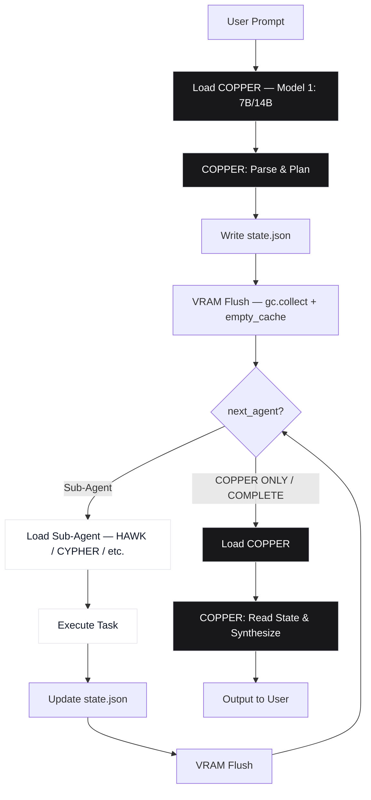
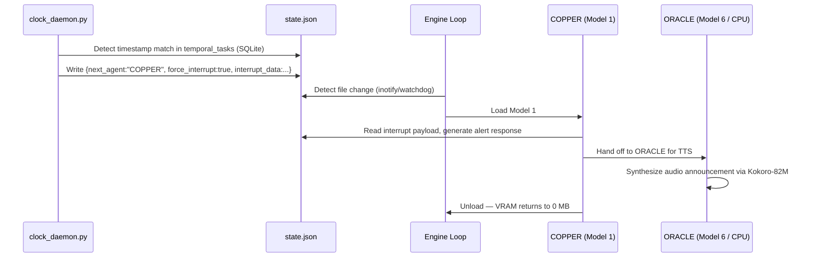

# COPPER Framework — Application Flow Specification

> **Documentation set:** [PRD](PRD.md) · [TRD](TRD.md) · [App Flow](APP_FLOW.md) · [UI/UX Brief](UI_UX_BRIEF.md) · [Backend Schema](BACKEND_SCHEMA.md) · [Implementation Guide](IMPLEMENTATION.md)

---

## 8. Primary Execution Flow: State-Persistent Hot-Swap

### 8.1 High-Level Flow Diagram

*Figure 1: COPPER Sequential Hot-Swap Execution Flow — dark nodes represent COPPER (Model 1) phases, light nodes represent sub-agent (Model 2–6) phases.*

### 8.2 Step-by-Step Execution Walkthrough

#### 8.2.1 Step 1 — User Input Ingestion

The user submits a natural language prompt via the React frontend, terminal, global hotkey overlay (`Alt+Space`), or wake-word trigger ("Hey COPPER"). The orchestration engine writes the raw prompt to `state.json` under `user_prompt` and sets `next_agent = "COPPER"`.

#### 8.2.2 Step 2 — COPPER Routing Pass

The engine loads Model 1 (14B or 7B reasoning) into VRAM. COPPER:

1. Reads the full `state.json` including conversation history
2. Cross-examines the user's intent (Socratic system prompt)
3. Determines which specialist agent(s) are required
4. Writes a structured task plan to `state.json` including `next_agent` and `next_model` keys
5. Issues a shutdown signal (`keep_alive: 0`)

#### 8.2.3 Step 3 — GPU Hard Reset

The Python orchestration loop intercepts the model shutdown, calls `flush_vram()`, and verifies VRAM allocation returns to 0 MB via Ollama's process API before proceeding.

#### 8.2.4 Step 4 — Sub-Agent Specialist Execution

The engine reads `next_model` from `state.json`, selects the appropriate model profile, attaches the agent's LoRA personality adapter, and loads it into the clean VRAM. The sub-agent:

1. Reads the full `state.json` and the last 3 entries of `dialogue_transcript`
2. Drops a peer-review commentary line (unless `SYSTEM_MODE: BOSS`)
3. Executes its specialist task
4. Appends results and dialogue to `state.json`
5. Unloads via `keep_alive: 0`

#### 8.2.5 Step 5 — COPPER Resurrection & Output Synthesis

VRAM is flushed again. Model 1 reloads. COPPER reads the complete updated `state.json`, verifies sub-agent outputs, formats the final user-facing response, and delivers it to the frontend. COPPER then unloads, returning VRAM to 0 MB.

---

### 8.3 Interrupt Flow: Background Alarm / Weather Trigger

1. `clock_daemon.py` detects timestamp match in `temporal_tasks` SQLite table
2. Daemon writes directly to `state.json`: `{"next_agent":"COPPER","force_interrupt":true,"interrupt_data":...}`
3. Main engine loop detects file change (inotify/watchdog), loads Model 1
4. COPPER reads interrupt payload and generates an alert response
5. ORACLE (Model 6 / CPU) synthesizes audio announcement via Kokoro-82M
6. COPPER unloads; VRAM returns to 0 MB

---

### 8.4 Passive Vision Flow: Screen Change Detection

1. KINETIC daemon triggers `screen_diff.py` every 5 seconds via APScheduler
2. OpenCV captures screenshot and computes pixel diff against previous frame
3. If diff exceeds threshold (e.g., progress bar at 100%), `state.json` is updated with `interrupt_type: "SCREEN_EVENT"`
4. HAWK (Model 4) loads into VRAM, analyzes screenshot, extracts relevant data
5. ORACLE announces the event via TTS; system returns to idle

---

### 8.5 Boss Mode Flow

1. User types "Boss Mode" or a custom trigger phrase
2. Engine writes `{"SYSTEM_MODE":"BOSS"}` to `state.json`
3. All subsequent agent prompts omit the personality injection and dialogue prefix
4. Agents output only `[TECHNICAL_PAYLOAD]` blocks; `[DIALOGUE]` blocks are stripped
5. User types "Casual Mode" to restore personality injection

---

## 9. Frontend Dashboard Flow

The React frontend polls `state.json` every **300 milliseconds** via a local Express.js bridge API. The dashboard is a passive observer of the orchestration engine — it never writes to `state.json` except for the Prompt Input and Confirmation Modal components.

### Component Architecture

| Component | Data Source | Behavior |
|---|---|---|
| **Pulse Badge** | `system_status` | Color-coded hardware state indicator (see [UI/UX Brief](UI_UX_BRIEF.md#pulse-badge) for state-color mapping) |
| **Action Banner** | `telemetry.current_action` | Displays the current telemetry action string |
| **VRAM Gauge** | `telemetry.vram_allocation_mb` | Live bar chart of VRAM allocation |
| **Dialogue Log** | `dialogue_transcript[]` | Scrolling terminal rendering of agent dialogue entries |
| **System Log** | `execution_logs[]` | Append-only execution log stream; auto-scroll to bottom |
| **Prompt Input** | `user_prompt` (write) | Glassmorphism overlay, triggered by `Alt+Space` or click |
| **Confirmation Modal** | `task_context` (write `Y`/`N`) | Amber-bordered popup for TALON/AXIS destructive actions |

For the full visual design system, component anatomy, and layout/motion specification applied to these components, see **[UI_UX_BRIEF.md](UI_UX_BRIEF.md)**.
