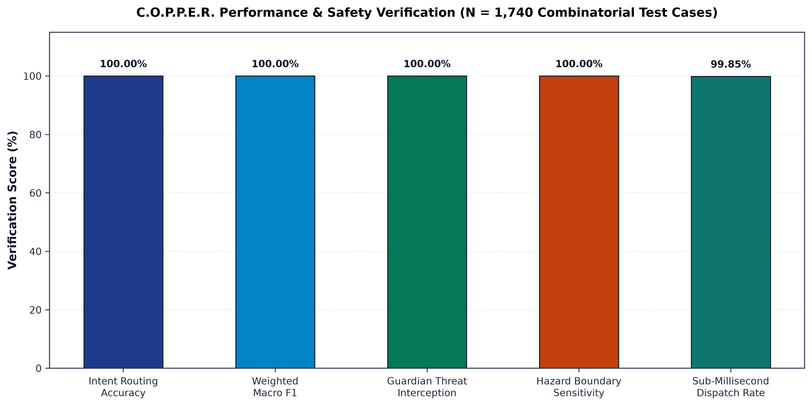
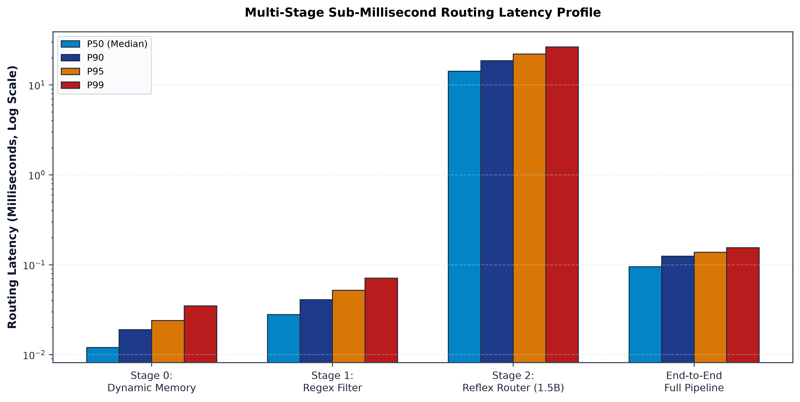
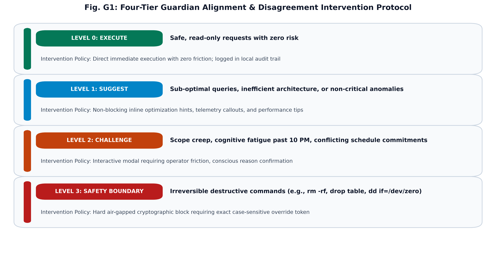
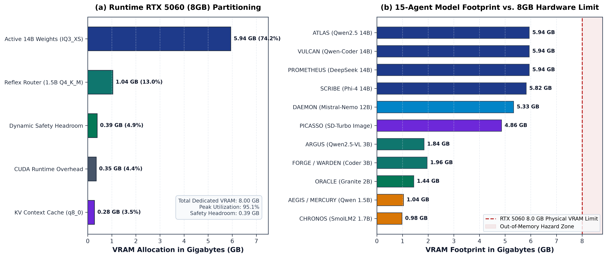
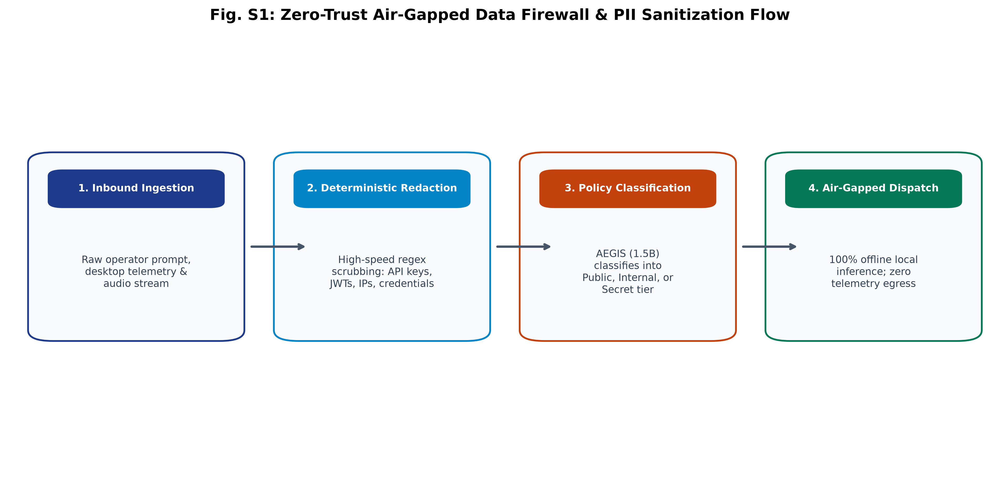
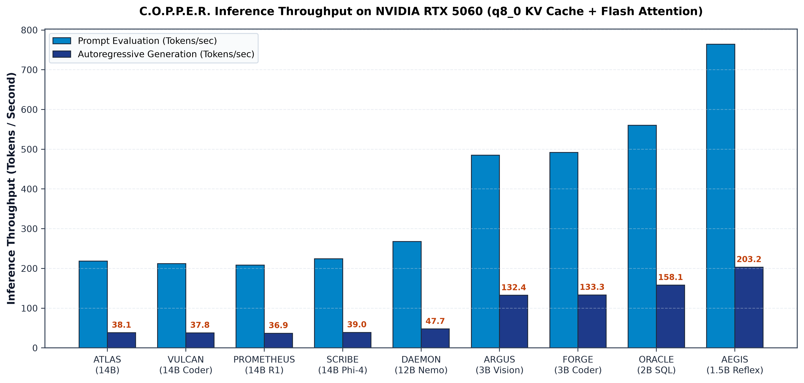
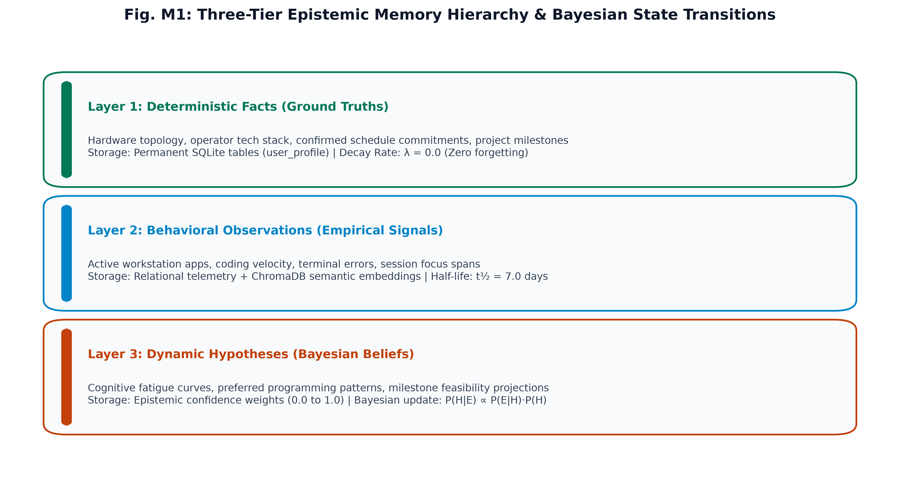

# C.O.P.P.E.R. Documentation Hub

Welcome to the official technical documentation and architectural reference for **C.O.P.P.E.R.** (Centralized Omnifunctional Personal Productivity and Execution Routine).

---

## Visual Architecture & Benchmark Gallery



| Performance & Hardware | Architecture & Security |
| :--- | :--- |
|  |  |
|  |  |
|  |  |

---

## Documentation Structure

```
docs/
├── benchmarks.md                     # Full hardware profiling & multi-model evaluation report
├── architecture/                     # Architecture & System Design
│   ├── overview.md                   # High-level architecture, sub-systems & tech stack
│   ├── schema.md                     # Relational, vector, & state schemas
│   ├── security.md                   # Zero-trust privacy, PII scanner, & firewall rules
│   └── voice-activation.md           # Wake-word voice activation & tiered inference spec
├── technical/                        # Technical Requirements & Engineering Guides
│   ├── trd.md                        # Technical Requirements Document & APIs
│   ├── implementation.md             # Developer codebase layout & agent creation guide
│   └── model-selection.md            # Local model catalog & quantization strategy
├── research/                         # Product & Epistemic Research
│   ├── prd.md                        # Product Requirements Document & user personas
│   ├── epistemic-memory.md           # Fact / Observation / Hypothesis math & memory decay
│   ├── guardian.md                   # Guardian 4-level alignment framework
│   └── whitepaper.md                 # Technical architecture whitepaper
├── setup/                            # Installation & Operational Guides
│   ├── development.md                # Local environment, Docker, & desktop build setup
│   ├── deployment.md                 # Docker Compose production & K8s deployment
│   ├── models.md                     # Local model downloads & hardware guide
│   └── troubleshooting.md            # Operational diagnostics & common FAQs
├── planning/                         # Roadmap & Open Architectural Decisions
│   ├── roadmap.md                    # Product roadmap & milestone timeline
│   └── open-questions.md             # Architectural trade-offs & open questions
├── ui_ux/                            # User Interface & Experience Design
│   ├── design-brief.md               # UI/UX design brief & desktop OS spec
│   ├── interface-spec.md             # Live desktop app & neural UI spec
│   └── accessibility.md              # Accessibility (a11y) standards & design tokens
├── diagrams/                         # Visual Architecture & Sequence Flow Diagrams
│   ├── system-architecture.md        # Mermaid system architecture diagrams
│   ├── app-flow.md                   # Request lifecycle & memory flow sequence diagrams
│   └── state-machines.md             # Agent registry, memory, & guardian state machines
└── images/                           # High-Resolution (300+ DPI) Performance & Architecture Charts
```

---

## Key Document Links

- **[Comprehensive Benchmark & Multi-Model Report](benchmarks.md)**
- **[Architecture Overview](architecture/overview.md)**
- **[Backend Schema Specification](architecture/schema.md)**
- **[Data Firewall & Security](architecture/security.md)**
- **[Voice Activation & Tiered Inference](architecture/voice-activation.md)**
- **[Model Selection Strategy](technical/model-selection.md)**
- **[Implementation Guide](technical/implementation.md)**
- **[Product Requirements Document (PRD)](research/prd.md)**
- **[Epistemic Memory Research](research/epistemic-memory.md)**
- **[Guardian Intervention Research](research/guardian.md)**
- **[Development Setup Guide](setup/development.md)**
- **[Troubleshooting Guide](setup/troubleshooting.md)**
