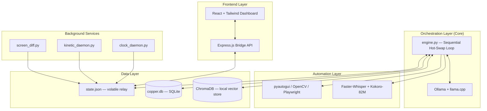

# Architecture — Index

> **Documentation hub:** [docs/README.md](../README.md) · **Related:** [TRD §6](../TRD.md#6-system-architecture-overview) · [Implementation Guide §13](../IMPLEMENTATION.md#13-project-directory-structure)

This folder documents COPPER's system architecture as a set of layers. It expands on [TRD §6 — System Architecture Overview](../TRD.md#6-system-architecture-overview) with a full layer-by-layer breakdown of technologies and responsibilities.

| Document | Status | Description |
|---|---|---|
| [architecture.md](architecture.md) | Stable | Layered architecture: Frontend, Orchestration, Automation, Data, Background Services, Audio I/O, Fine-Tuning Tooling, Dev/CI |

---

## ⚠️ Revision Note

An earlier draft of `architecture.md` described a cloud-hybrid stack (FastAPI + LangChain + OpenAI APIs, PostgreSQL, Redis, Docker/Docker Compose). That draft **directly contradicted** the core specification:

- [PRD §2.3 — Non-Goals](../PRD.md#23-non-goals): *"Cloud model inference (no OpenAI/Gemini API dependency)"*
- [PRD §2.2 — G1 Hardware Safety](../PRD.md#22-primary-goals): *"Never exceed 6 GB peak VRAM usage... Never exceed 14 GB System RAM usage"*
- [TRD §6.1 — Core Invariant](../TRD.md#61-architecture-pattern-sequential-hot-swap-engine): *"Only one model may occupy VRAM at any given nanosecond"*
- [PRD §5 — Database Idle RAM](../PRD.md#5-hardware-constraints--performance-targets): *"0 MB ... SQLite serverless architecture"*

A server-based stack (Postgres/Redis daemons, Docker containers, cloud LLM APIs) is incompatible with all four of these constraints. `architecture.md` has been rewritten to describe the **actual local-only, sequential, serverless** architecture mandated by the PRD and TRD.

The original draft has been preserved — not discarded — at **[research/architecture-alternatives.md](../research/architecture-alternatives.md)**, with a rationale for why it was not adopted. If a future cloud-hybrid or multi-user deployment mode is ever pursued, that document is the starting point, but it would require revisiting the PRD's non-goals first.

---

## High-Level Layer Map

Each box maps to a section of [architecture.md](architecture.md); the data flows shown here are the same flows detailed step-by-step in [App Flow §8](../APP_FLOW.md#8-primary-execution-flow-state-persistent-hot-swap).
