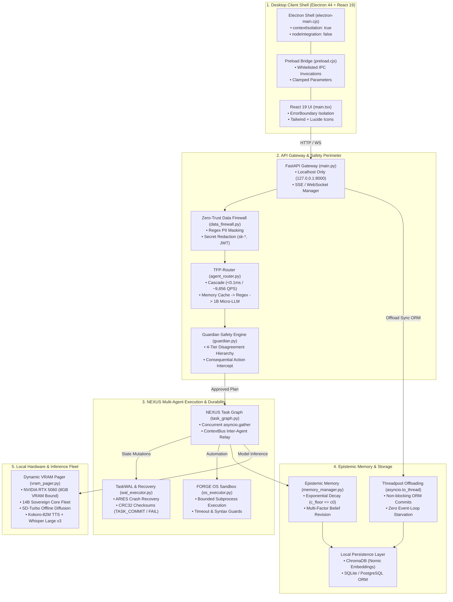

# C.O.P.P.E.R. Architecture & Systems Engineering Hub

**Centralized Omnifunctional Personal Productivity and Execution Routine**  
*An independent, 100% offline, local-first personal AI operating system executing entirely on consumer hardware.*

---

## 🌟 Interactive Architecture Diagram (Powered by Archify)

Explore the full system architecture interactively:

👉 **[Launch Interactive Architecture Diagram (HTML)](copper_architecture.html)** 👈

The diagram is a self-contained, browser-verified HTML visualization generated using the [Archify](https://github.com/tt-a1i/archify) agent skill. It requires no server, no plugins, and works offline in any modern browser.

### Interactive Exploration Features & Hotkeys

Open [`copper_architecture.html`](copper_architecture.html) in your browser (e.g., Chrome, Edge, Firefox, Brave) and use the following keyboard shortcuts:

| Key | Mode / Action | Description |
| :---: | :--- | :--- |
| **`?`** | **Shortcuts Guide** | Opens the interactive help modal with all controls |
| **`/`** | **Search & Focus** | Instantly search components (e.g. `Router`, `Guardian`, `WAL`) and highlight their connections |
| **`R`** | **Trace Route** | Trace upstream and downstream execution flow across components |
| **`P`** | **Play Story** | Plays an animated, chapter-based presentation of the architecture |
| **`F`** | **Presentation Mode** | Fullscreen distraction-free view ideal for interview demos and presentations |
| **`T`** | **Theme Toggle** | Switch between dark terminal and clean light themes |
| **`E`** | **Export** | Export high-resolution PNG, SVG, or share cards (1200×630) |

---

## 🏛️ System Architecture Topology


```mermaid
flowchart TD
    subgraph ClientTier["1. Desktop Client Shell (Electron 44 + React 19)"]
        direction TB
        Electron["Electron Shell (electron-main.cjs)<br/>• contextIsolation: true<br/>• nodeIntegration: false"]
        Preload["Preload Bridge (preload.cjs)<br/>• Whitelisted IPC Invocations<br/>• Clamped Parameters"]
        ReactUI["React 19 UI (main.tsx)<br/>• ErrorBoundary Isolation<br/>• Tailwind + Lucide Icons"]
        
        Electron --- Preload
        Preload --- ReactUI
    end

    subgraph GatewayTier["2. API Gateway & Safety Perimeter"]
        direction TB
        FastAPI["FastAPI Gateway (main.py)<br/>• Localhost Only (127.0.0.1:8000)<br/>• SSE / WebSocket Manager"]
        Firewall["Zero-Trust Data Firewall (data_firewall.py)<br/>• Regex PII Masking<br/>• Secret Redaction (sk-*, JWT)"]
        Router["TFP-Router (agent_router.py)<br/>• Cascade (<0.1ms / ~9,856 QPS)<br/>• Memory Cache -> Regex -> 1B Micro-LLM"]
        Guardian["Guardian Safety Engine (guardian.py)<br/>• 4-Tier Disagreement Hierarchy<br/>• Consequential Action Intercept"]
        
        ReactUI -- HTTP / WS --> FastAPI
        FastAPI --> Firewall
        Firewall --> Router
        Router --> Guardian
    end

    subgraph ExecutionTier["3. NEXUS Multi-Agent Execution & Durability"]
        direction TB
        DAG["NEXUS Task Graph (task_graph.py)<br/>• Concurrent asyncio.gather<br/>• ContextBus Inter-Agent Relay"]
        WAL["TaskWAL & Recovery (wal_executor.py)<br/>• ARIES Crash Recovery<br/>• CRC32 Checksums (TASK_COMMIT / FAIL)"]
        Sandbox["FORGE OS Sandbox (os_executor.py)<br/>• Bounded Subprocess Execution<br/>• Timeout & Syntax Guards"]
        
        Guardian -- Approved Plan --> DAG
        DAG -- State Mutations --> WAL
        DAG -- Automation --> Sandbox
    end

    subgraph MemoryTier["4. Epistemic Memory & Storage"]
        direction TB
        Memory["Epistemic Memory (memory_manager.py)<br/>• Exponential Decay (c_floor <= c0)<br/>• Multi-Factor Belief Revision"]
        VectorDB["Local Persistence Layer<br/>• ChromaDB (Nomic Embeddings)<br/>• SQLite / PostgreSQL ORM"]
        Workers["Threadpool Offloading (asyncio.to_thread)<br/>• Non-blocking ORM Commits<br/>• Zero Event-Loop Starvation"]
        
        DAG --> Memory
        Memory --> VectorDB
        FastAPI -- Offload Sync ORM --> Workers
        Workers --> VectorDB
    end

    subgraph HardwareTier["5. Local Hardware & Inference Fleet"]
        direction TB
        VRAM["Dynamic VRAM Pager (vram_pager.py)<br/>• NVIDIA RTX 5060 (8GB VRAM Bound)<br/>• 14B Sovereign Core Fleet<br/>• SD-Turbo Offline Diffusion<br/>• Kokoro-82M TTS + Whisper Large v3"]
        
        DAG -- Model Inference --> VRAM
    end
```

---

## 🔒 Engineering Guarantees & Production Rigor

### 1. Epistemic Decay Monotonicity
The hypothesis confidence decay equation models human forgetting over elapsed time $\Delta t$:
$$c(t) = c_{\text{floor}} + (c_0 - c_{\text{floor}}) \cdot e^{-\lambda \Delta t}$$
To prevent the mathematical paradox where hypotheses with low initial confidence $c_0$ and high importance $I$ gain confidence over time, C.O.P.P.E.R. strictly enforces:
$$c_{\text{floor}} = \min\left(c_0,\, 0.05 + 0.50 \cdot \text{clamp}(I, 0.0, 1.0)\right)$$

### 2. ARIES-Inspired Crash Consistency
In multi-agent DAG execution, system crashes midway through a pipeline must not leave corrupted state or cause duplicate side-effects. The `TaskWAL` engine enforces a two-phase protocol:
- **`DAG_START` & `TASK_INTENT`:** Logs task parameters and an idempotency key `sha256(dag_id:task_id:instruction)` before dispatch.
- **`TASK_COMMIT` & `DAG_COMMIT`:** Appends cryptographically verified CRC32 checksum records upon completion.
- **Automated Startup Recovery:** Reconstructs completed task outputs (Redo Phase) and compensates partial uncommitted file mutations (Undo Phase with `TASK_COMPENSATE`).

### 3. Event Loop Protection in FastAPI
FastAPI async routes offload synchronous SQLAlchemy queries to background worker threads via `asyncio.to_thread`:
```python
await asyncio.to_thread(_save_history, db, session_id, req.message, result["response"])
```
This guarantees that blocking database disk/socket I/O never halts the single-threaded asyncio event loop, eliminating token streaming latency spikes and WebSocket frame drops.

### 4. Hardened Desktop Shell (Electron + React 19)
- **Context Isolation:** Enabled on all windows (`mainWindow`, `quickBarWindow`) with `nodeIntegration: false` and `webSecurity: true`.
- **Preload Bridge:** [`frontend/preload.cjs`](../../frontend/preload.cjs) uses `contextBridge.exposeInMainWorld('copperAPI', ...)` with an explicit whitelist of authorized IPC invocations (`quick-bar-hide`, `quick-bar-resize`, `get-backend-status`, `start-backend`, `stop-backend`).
- **React Error Boundary:** [`frontend/src/components/common/ErrorBoundary.tsx`](../../frontend/src/components/common/ErrorBoundary.tsx) isolates component-level rendering errors, preventing desktop white-screen crashes.

### 5. Hardware-Bounded Local Fleet (8GB VRAM)
- Heavy generative diffusion (`SD-Turbo` at ~4.86GB) and primary text LLMs (`Qwen2.5-14B` at ~4.2GB Q4_K_M) are multiplexed dynamically via `vram_pager.py`, ensuring memory allocations never exceed the 8.0GB hardware ceiling.
- Zero external cloud egress guarantees 100% offline data sovereignty.

---

## 🛠️ The Archify Agent Skill

Archify is installed in this repository at [`.agents/skills/archify/`](../../.agents/skills/archify/):

```powershell
# Verify Archify health check
node .agents/skills/archify/bin/archify.mjs doctor

# Re-render architecture diagram from specification
node .agents/skills/archify/bin/archify.mjs finalize architecture .archify/copper-architecture-20260929-212500/copper.architecture.json docs/architecture/copper_architecture.html --repo-root . --quality showcase --json
```
