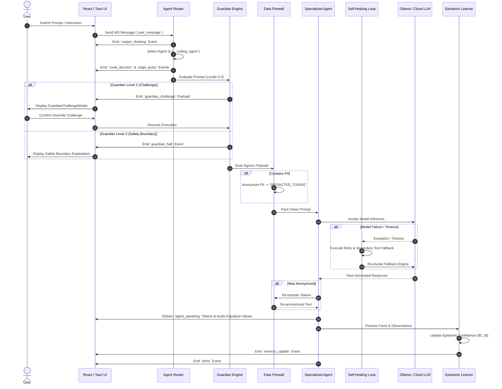
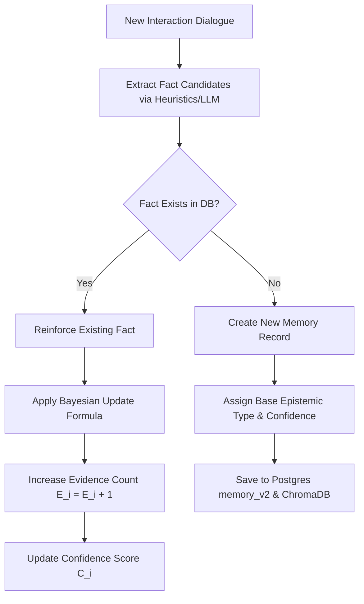

# C.O.P.P.E.R. Application Flow & Sequence Diagrams

---

## 1. Complete Request Lifecycle Sequence Diagram

```mermaid
sequenceDiagram
    autonumber
    actor User
    participant Frontend as React / Tauri UI
    participant Router as Agent Router
    participant Guardian as Guardian Engine
    participant Firewall as Data Firewall
    participant Agent as Specialized Agent
    participant Healing as Self-Healing Loop
    participant LLM as Ollama / Cloud LLM
    participant Memory as Epistemic Learner

    User->>Frontend: Submit Prompt / Instruction
    Frontend->>Router: Send WS Message (`user_message`)
    Router->>Frontend: Emit `copper_thinking` Event
    Router->>Router: Select Agent (e.g. `coding_agent`)
    Router->>Frontend: Emit `route_decision` & `edge_pulse` Events
    
    Router->>Guardian: Evaluate Prompt (Levels 0-3)
    alt Guardian Level 2 (Challenge)
        Guardian->>Frontend: Emit `guardian_challenge` Payload
        Frontend->>User: Display GuardianChallengeModal
        User->>Frontend: Confirm Override Challenge
        Frontend->>Guardian: Resume Execution
    else Guardian Level 3 (Safety Boundary)
        Guardian->>Frontend: Emit `guardian_halt` Event
        Frontend->>User: Display Safety Boundary Explanation
    end

    Guardian->>Firewall: Scan Egress Payload
    alt Contains PII
        Firewall->>Firewall: Anonymize PII -> `[REDACTED_TOKEN]`
    end

    Firewall->>Agent: Pass Clean Prompt
    Agent->>LLM: Invoke Model Inference
    
    alt Model Failure / Timeout
        LLM-->>Healing: Exception / Timeout
        Healing->>Healing: Execute Retry & Secondary Tool Fallback
        Healing->>LLM: Re-invoke Fallback Engine
    end
    
    LLM-->>Agent: Raw Generated Response
    
    alt Was Anonymized
        Agent->>Firewall: Re-hydrate Tokens
        Firewall-->>Agent: De-anonymized Text
    end

    Agent->>Frontend: Stream `agent_speaking` Tokens & Audio Equalizer Values
    Agent->>Memory: Process Facts & Observations
    Memory->>Memory: Update Epistemic Confidence ($C_i$)
    Memory->>Frontend: Emit `memory_update` Event
    Agent->>Frontend: Emit `done` Event
```

---

## 2. Epistemic Memory Update Flow

```mermaid
flowchart TD
    A[New Interaction Dialogue] --> B[Extract Fact Candidates via Heuristics/LLM]
    B --> C{Fact Exists in DB?}
    C -- Yes --> D[Reinforce Existing Fact]
    D --> E[Apply Bayesian Update Formula]
    E --> F[Increase Evidence Count E_i = E_i + 1]
    F --> G[Update Confidence Score C_i]
    C -- No --> H[Create New Memory Record]
    H --> I[Assign Base Epistemic Type & Confidence]
    I --> J[Save to Postgres memory_v2 & ChromaDB]
```
