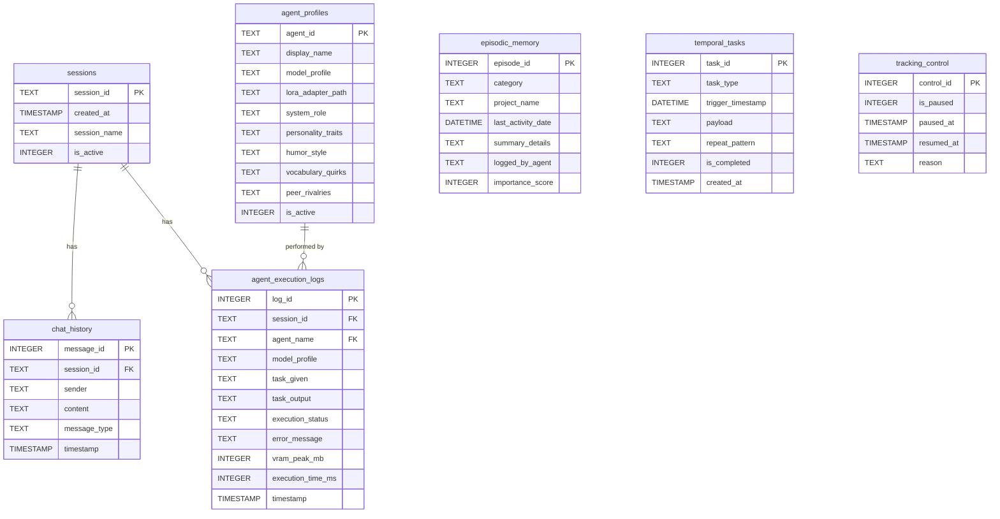

# Diagrams — Catalog

> **Documentation hub:** [docs/README.md](../README.md)

This folder is the canonical location for diagram source files (`.mmd` Mermaid sources, or exported `.svg`/`.png`). Diagrams embedded inline in other documents should have their source duplicated here (or linked back from here) so they can be reused, exported, and versioned independently of the prose that surrounds them.

---

## Existing Diagrams (embedded inline)

These diagrams currently live inline in their respective documents. This catalog tracks them so they're discoverable from one place.

| Diagram | Type | Location | Description |
|---|---|---|---|
| Sequential Hot-Swap Execution Flow (Figure 1) | Mermaid flowchart | [App Flow §8.1](../APP_FLOW.md#81-high-level-flow-diagram) | The primary user-prompt → response loop, including the COPPER/sub-agent hot-swap cycle |
| Interrupt Flow Sequence | Mermaid sequence diagram | [App Flow §8.3](../APP_FLOW.md#83-interrupt-flow-background-alarm--weather-trigger) | `clock_daemon.py` → `state.json` → engine → COPPER → ORACLE alarm flow |
| Architecture Layer Map | Mermaid flowchart | [architecture/README.md](../architecture/README.md#high-level-layer-map) | Seven-layer architecture overview and `state.json` as the central relay |

---

## New Diagram: `copper.db` Entity-Relationship Diagram

Added to support [Backend Schema §12](../BACKEND_SCHEMA.md#12-sqlite-database-schema-copperdb) — useful when reasoning about joins/indexes or onboarding someone to the data model without reading seven `CREATE TABLE` statements.



> **Note:** `agent_execution_logs.agent_name` is shown as a logical FK to `agent_profiles.agent_id`, but no `FOREIGN KEY` constraint is declared in [Backend Schema §12.3](../BACKEND_SCHEMA.md#123-agent-execution-logs-table) — this is intentional, since `agent_execution_logs` may log entries for `agent_name = 'COPPER'` (the orchestrator itself) before `agent_profiles` is fully seeded. `episodic_memory`, `temporal_tasks`, and `tracking_control` are intentionally standalone (no FKs), per [Backend Schema §12.5–12.7](../BACKEND_SCHEMA.md#125-episodic-memory-table).

---

## Recommended Additions (Not Yet Created)

| Diagram | Would support | Priority |
|---|---|---|
| Dashboard wireframe / component layout | [UI/UX Brief §4 Layout & Composition](../UI_UX_BRIEF.md#4-layout--composition) | High — would resolve ambiguity in panel arrangement before frontend implementation begins |
| 6-model VRAM allocation timeline | [TRD §6.2](../TRD.md#62-the-6-model-specialist-architecture) | Medium — visualize peak/idle VRAM across a multi-agent task |
| Agent dependency graph (which agents call which) | [PRD §3](../PRD.md#3-the-30-agents--full-roster) | Medium — useful for `agent_profiles.peer_rivalries` consistency checks |

---

## Exporting Mermaid Diagrams

To export any diagram in this repo to SVG/PNG for use in slides or external docs, use [`mermaid-cli`](https://github.com/mermaid-js/mermaid-cli):

```bash
npm install -g @mermaid-js/mermaid-cli

# Export a single diagram source file
mmdc -i diagrams/hot-swap-flow.mmd -o diagrams/hot-swap-flow.svg

# Export with a theme matching the AeroNet-derived palette (UI/UX Brief §2.1)
mmdc -i diagrams/hot-swap-flow.mmd -o diagrams/hot-swap-flow.svg \
  -b transparent --theme dark
```

When extracting a diagram from an embedded Mermaid block (e.g. in `APP_FLOW.md`), copy the fenced code block contents (without the ` ```mermaid ` / ` ``` ` markers) into a new `.mmd` file in this folder, named to match the catalog table above.
