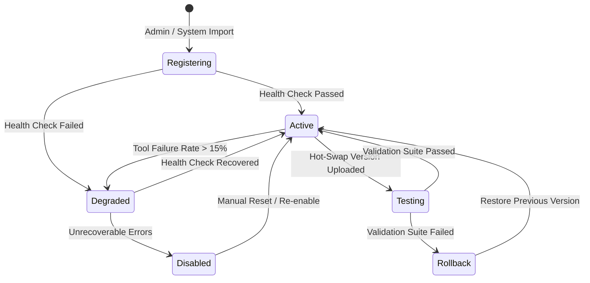
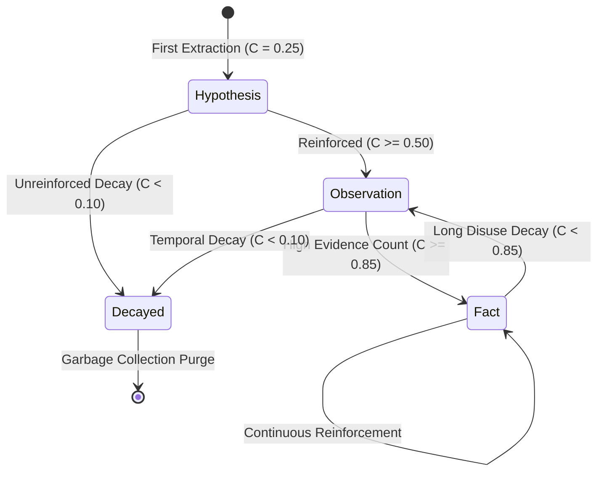
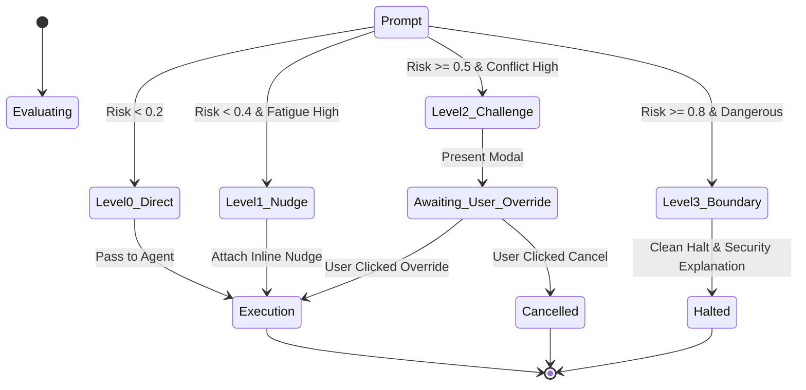

# C.O.P.P.E.R. State Machine Specifications

---

## 1. Agent Registry Lifecycle State Machine

---

## 2. Epistemic Memory State Transition Machine

---

## 3. Guardian Challenge Flow State Machine

