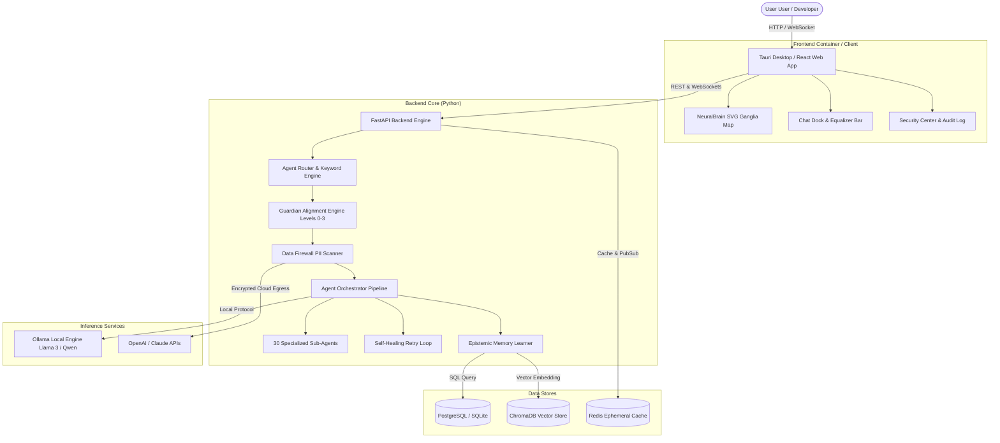
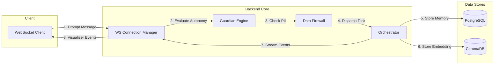

# System Architecture Diagrams

---

## 1. High-Level System Architecture Diagram

```mermaid
graph TD
    User([User User / Developer]) -->|HTTP / WebSocket| UI[Tauri Desktop / React Web App]
    
    subgraph Frontend ["Frontend Container / Client"]
        UI --> NeuralMap[NeuralBrain SVG Ganglia Map]
        UI --> ChatDock[Chat Dock & Equalizer Bar]
        UI --> SecCenter[Security Center & Audit Log]
    end
    
    UI -->|REST & WebSockets| API[FastAPI Backend Engine]
    
    subgraph Backend ["Backend Core (Python)"]
        API --> Router[Agent Router & Keyword Engine]
        Router --> Guardian[Guardian Alignment Engine Levels 0-3]
        Guardian --> Firewall[Data Firewall PII Scanner]
        Firewall --> Orchestrator[Agent Orchestrator Pipeline]
        Orchestrator --> Agents[30 Specialized Sub-Agents]
        Orchestrator --> SelfHealing[Self-Healing Retry Loop]
        Orchestrator --> Learner[Epistemic Memory Learner]
    end
    
    subgraph Services ["Inference Services"]
        Orchestrator -->|Local Protocol| Ollama[Ollama Local Engine Llama 3 / Qwen]
        Firewall -->|Encrypted Cloud Egress| CloudLLM[OpenAI / Claude APIs]
    end
    
    subgraph Persistence ["Data Stores"]
        Learner -->|SQL Query| DB[(PostgreSQL / SQLite)]
        Learner -->|Vector Embedding| VectorDB[(ChromaDB Vector Store)]
        API -->|Cache & PubSub| Redis[(Redis Ephemeral Cache)]
    end
```

---

## 2. Component Interaction Architecture

```mermaid
graph LR
    subgraph Client
        WS[WebSocket Client]
    end

    subgraph Backend Core
        WSHelper[WS Connection Manager]
        Guardian[Guardian Engine]
        Firewall[Data Firewall]
        Orchestrator[Orchestrator]
    end

    subgraph Data Stores
        PG[(PostgreSQL)]
        VectorDB[(ChromaDB)]
    end

    WS -->|1. Prompt Message| WSHelper
    WSHelper -->|2. Evaluate Autonomy| Guardian
    Guardian -->|3. Check PII| Firewall
    Firewall -->|4. Dispatch Task| Orchestrator
    Orchestrator -->|5. Store Memory| PG
    Orchestrator -->|6. Store Embedding| VectorDB
    Orchestrator -->|7. Stream Events| WSHelper
    WSHelper -->|8. Visualizer Events| WS
```
