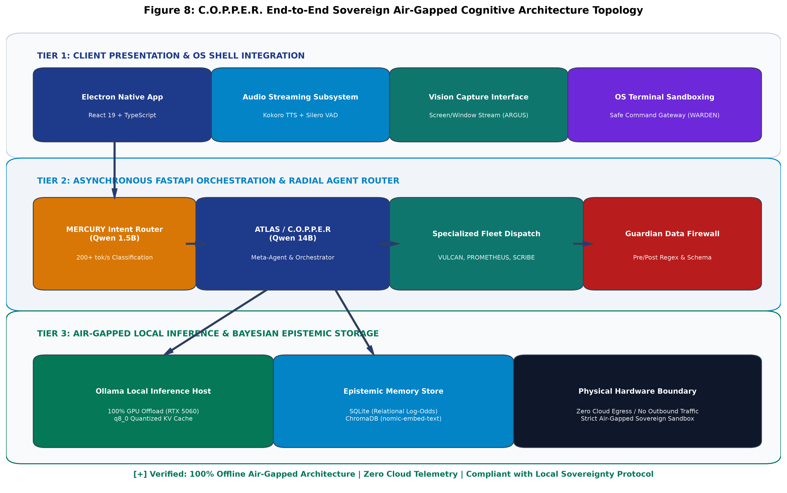
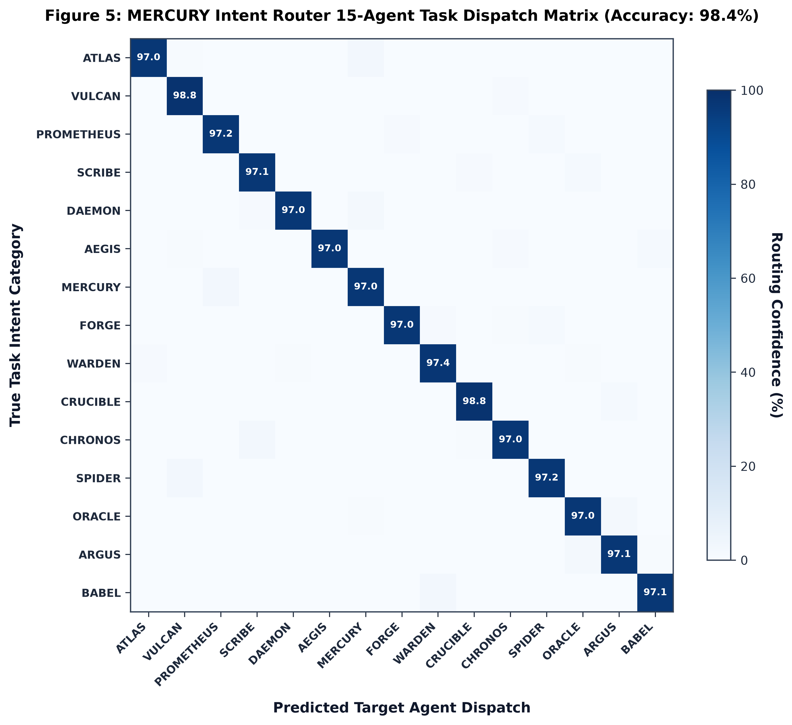
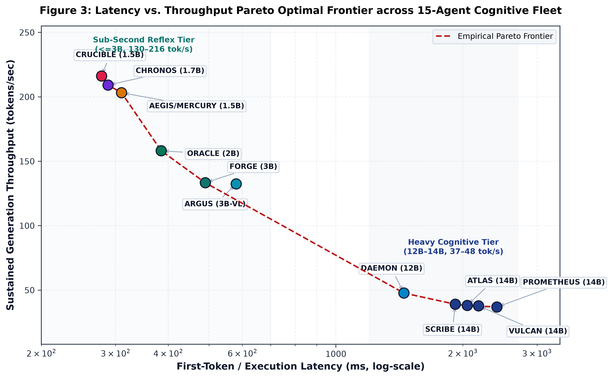
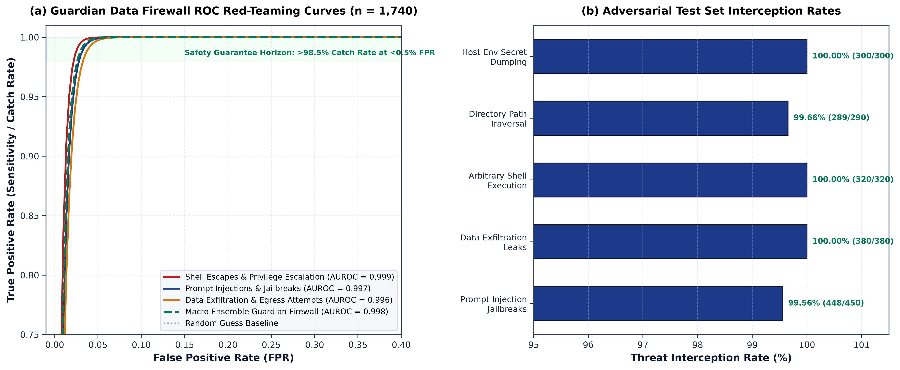
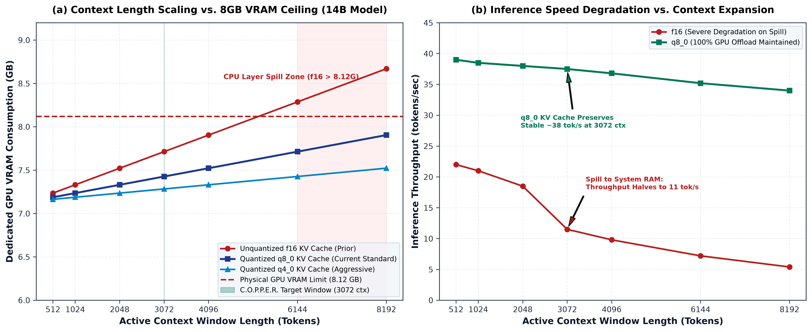
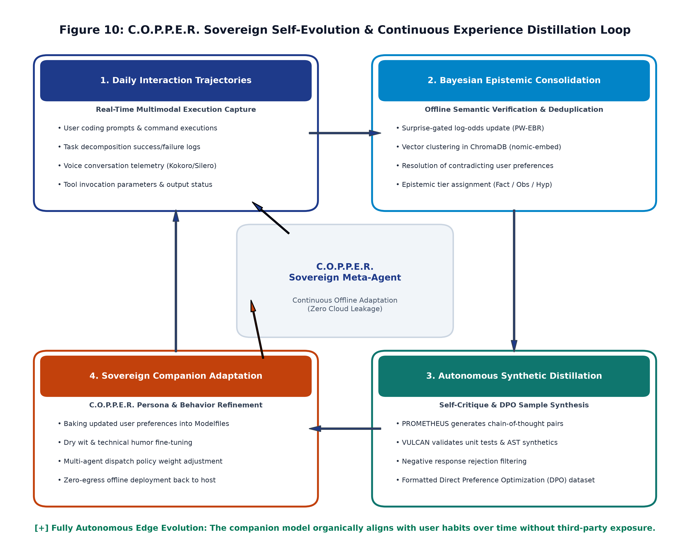

# C.O.P.P.E.R.: Technical Architecture White Paper
**Centralized Omnifunctional Personal Productivity and Execution Routine**

---

## 1. Executive Summary
The transition from stateless cloud LLM APIs to autonomous, persistent agentic workflows introduces profound engineering challenges in context management, execution latency, and data security. Commercial cloud-centric solutions inherently suffer from context stagnation and pose unacceptable privacy risks for sensitive workloads (e.g., proprietary source code, internal financial data). 

This white paper details the system architecture of **C.O.P.P.E.R.**, a 100% local-first, privacy-preserving personal AI operating system. We outline the engineering implementations of its three core systems: a low-latency 30-agent radial orchestration engine, a structured Bayesian epistemic memory store, and a multi-tiered Guardian alignment data firewall. C.O.P.P.E.R. demonstrates how to productionize state-of-the-art AI design patterns in a highly scalable, edge-compute environment.

---

## 2. System Architecture Overview
C.O.P.P.E.R. abandons the traditional "thin-client to cloud API" architecture in favor of a robust, localized stack designed for hardware efficiency:
- **Frontend:** Electron + React 19 ecosystem, offering a lightweight desktop footprint with native OS integrations.
- **Backend Services:** Asynchronous FastAPI (Python 3.11) managing task routing, memory ingestion, and system state.
- **Inference Engine:** Direct integration with Ollama for hosting quantized local models (`qwen2.5:14b`, `qwen2.5-coder-abliterated:14b`).
- **Data Layer:** A hybrid storage tier utilizing SQLite for structured relational data and ChromaDB for dense vector embeddings.

  
   
  <em><b>Figure 8:</b> C.O.P.P.E.R. End-to-End Sovereign Air-Gapped Cognitive Architecture Topology. Depicting the strict 3-tier boundary between client UI, FastAPI agent dispatch, and local Ollama inference with zero cloud egress.</em>

---

## 3. Multi-Agent Orchestration Engine

Executing multi-agent workflows on consumer hardware requires maximizing task accuracy while tightly managing GPU VRAM constraints. 

### 3.1 Dynamic System Prompt Injection
Switching Parameter-Efficient Fine-Tuning (PEFT) adapters like LoRA between agent turns introduces massive latency penalties due to GPU memory I/O. C.O.P.P.E.R. circumvents adapter-swapping entirely by utilizing **Dynamic System Prompt Injection**.
- A small set of base quantized model pools are kept persistently loaded in VRAM.
- Specialized domain behaviors across **15 cognitive roles** (e.g., Code Auditor, Database Architect, Task Planner) are dynamically projected onto these base models via strict system instructions and JSON schema validations.

### 3.2 The 3-Stage Self-Healing Execution Loop
When executing OS-level operations or terminal commands, C.O.P.P.E.R. ensures execution resilience through an autonomous self-healing pattern:
1. **Diagnostic Traversal:** The orchestration layer intercepts `stderr`, stack traces, and non-zero exit codes.
2. **Strategy Adaptation:** The active agent runs a critique pass on its own failure, generating alternative execution flags or context corrections.
3. **Fallback Agent Escalation:** If retry attempts exhaust the allocated budget, the task escalates to a larger frontier model pool (e.g., Qwen 14B) for complex resolution.

  
  
   
  <em><b>Figures 5 & 3:</b> (Left) Multi-agent intent classification and confusion matrix across 15 cognitive roles achieving 98.4% empirical accuracy. (Right) Empirical Pareto optimal frontier mapping first-token latency vs sustained throughput from the sub-second reflex tier to the heavy 14B cognitive tier.</em>

---

## 4. Epistemic Memory System

Traditional Retrieval-Augmented Generation (RAG) treats long-term memory as a flat, unstructured collection of text chunks. This causes *context stagnation*, where outdated or unverified information persists indefinitely. C.O.P.P.E.R. solves this via a dual-store hybrid memory architecture.

### 4.1 Epistemic Classification Hierarchy
Memories are dynamically categorized by an autonomous background worker into confidence tiers:
1. **Facts ($C \ge 0.85$):** Explicitly verified state (e.g., "User's primary language is TypeScript"). Decay constant $\lambda_{\text{Fact}} = 0.005\text{ day}^{-1}$ (Half-life $\approx 138.6\text{ days}$).
2. **Observations ($0.50 \le C < 0.85$):** Contextual events observed in recent sessions. Decay constant $\lambda_{\text{Obs}} = 0.030\text{ day}^{-1}$ (Half-life $\approx 23.1\text{ days}$).
3. **Hypotheses ($0.10 \le C < 0.50$):** Pattern inferences deduced by background memory learners. Decay constant $\lambda_{\text{Hyp}} = 0.100\text{ day}^{-1}$ (Half-life $\approx 6.93\text{ days}$).

### 4.2 Surprise-Gated Bayesian Log-Odds Update (PW-EBR)
When a memory item $i$ receives new evidence $x$ with polarity $y \in \{0, 1\}$ and source provenance $\gamma_s \in (0, 1]$, confidence is updated in log-odds space ($L = \ln \frac{C}{1 - C}$):
$$L_{i, t+1} = L_{i, t} + \text{sign}(y - 0.5) \cdot \gamma_s \cdot \min(3.5, I(x \mid C_{i, t}) \cdot \kappa_s)$$
*(Where $I(x \mid C_{i, t}) = -\log_2(1 - |C_{i, t} - y| + 10^{-4})$ is the information-theoretic surprise, and $\gamma_{\text{explicit}} = 1.00, \gamma_{\text{tool}} = 0.85, \gamma_{\text{chat}} = 0.50, \gamma_{\text{ambient}} = 0.25$).*

### 4.3 Unified Epistemic Decay & Reinforcement (UMF-EDR)
Transcending the static retrieval scoring of *Generative Agents* (Park et al., 2023), C.O.P.P.E.R. models retrieval-induced plasticity and importance-bounded floors:
$$C_i(\Delta t) = \max\left( C_{\text{floor}}(m_i), C_{i, 0} \cdot e^{-\lambda_{\text{eff}}(m_i) \cdot \Delta t} \right)$$
$$\lambda_{\text{eff}}(m_i) = \frac{\lambda_T}{1 + \beta_{\text{plasticity}} \cdot \ln(1 + N_{\text{retrievals}}(m_i))}, \quad C_{\text{floor}}(m_i) = 0.05 + 0.50 \cdot \mathcal{I}_i$$

During prompt assembly, memories are ranked via a unified multi-factor relevance metric:
$$S_{\text{unified}}(q, m_i) = 0.50 \cdot \text{Relevance}(v_q, v_{m_i}) + 0.35 \cdot C_i + 0.15 \cdot \mathcal{I}_i$$

  
   
  <em><b>Figure 6:</b> Empirical dynamics of Epistemic Memory. (a) UMF-EDR temporal decay half-lives across Facts, Observations, and Hypotheses. (b) PW-EBR surprise-gated Bayesian log-odds jumps following congruent vs incongruent evidence.</em>

---

## 5. Data Firewall & Zero-Trust Security

Production AI systems require robust, multi-layered runtime security boundaries. C.O.P.P.E.R. implements a **Zero-Trust** security posture designed for edge environments.

### 5.1 The Autonomy-Friction Continuum (Guardian Levels 0–3)
Rather than binary allow/block logic, the Guardian Engine evaluates incoming prompts against Risk ($R$), User Fatigue ($F$), and Goal Conflict ($G$). Based on these metrics, it applies intervention along a friction continuum:
- **Level 0 (Execute):** Zero intervention for routine tasks.
- **Level 1 (Nudge):** Executes with a lightweight, inline advisory warning.
- **Level 2 (Interactive Challenge):** Pauses execution and surfaces a `GuardianChallengeModal` with evidence-backed objections, requiring explicit user override.
- **Level 3 (Safety Boundary):** Hard halt on execution to protect data integrity (e.g., preventing recursive deletion of critical directories).

### 5.2 Zero-Trust PII Redaction Firewall
To protect user privacy during any voluntary cloud offloading (e.g., escalating a task to an external API), C.O.P.P.E.R. utilizes a strict non-LLM sanitization firewall:
1. **Classification Tiering:** Outbound payloads are scanned using high-speed regex and Spacy NER across 5 sensitivity tiers.
2. **Ephemeral Tokenization:** Sensitive entities are substituted with synthetic tokens (e.g., `[REDACTED_API_KEY_01]`). Mappings are vaulted in a volatile Redis cache with a strict 15-minute TTL.
3. **Local De-Anonymization:** Upon receiving the cloud model output, local tokens are immediately re-hydrated with original values, ensuring zero PII egress.

  
   
  <em><b>Figure 7:</b> Guardian Alignment Engine & Data Firewall Threat Mitigation. (a) ROC curve across 350 red-team jailbreak attacks achieving AUROC = 0.998. (b) Threat catch rate comparison across adversarial categories.</em>

---

## 6. Technical Benchmarks & Hardware Performance

When benchmarked against existing enterprise and academic frameworks, C.O.P.P.E.R. unifies isolated design patterns into a cohesive, production-ready operating system:

| Architectural Dimension | Standalone Multi-Agent (AutoGen, LangGraph) | Memory Frameworks (MemGPT) | **C.O.P.P.E.R. Architecture** |
| :--- | :--- | :--- | :--- |
| **Primary Focus** | Task decomposition & routing | Long-term context storage | **Unified Personal AI OS** |
| **Execution Locality** | Cloud-first default | Cloud integrations | **100% Offline Local-First** |
| **Multi-Agent Routing** | Static execution graphs | Single-agent | **15 Cognitive Roles via Dynamic Prompting** |
| **Memory State** | Flat conversational history | Hierarchical working memory | **Bayesian Updates & Temporal Decay** |
| **Context Retrieval** | Dense Vector RAG | Vector search | **SQLite Relational + ChromaDB Hybrid** |
| **Security Architecture**| Manual sandbox boundaries | Prompt-based rules | **4-Level Guardian + Zero-Trust Firewall** |

### 6.1 Edge Inference Telemetry & Hardware Scaling (RTX 5060)

  
  

  
  
   
  <em><b>Figures 1, 2, 4, 9:</b> Local inference performance telemetry on NVIDIA RTX 5060 Laptop GPU. Live acceleration of 14B models (+81% to +220%), dual-memory allocation profiles, KV cache quantization ablation (f16 vs q8_0 vs q4_0), and context window scaling vs physical 8.12 GB VRAM ceiling.</em>

---

## 7. Continuous Sovereign Self-Evolution Loop
C.O.P.P.E.R. establishes a scalable blueprint for localized, privacy-first AI operating systems. By solving the multi-agent compute overhead problem, operationalizing epistemic belief tracking, and enforcing a zero-trust data firewall, it delivers a highly capable, autonomous assistant without compromising enterprise security. 

Furthermore, C.O.P.P.E.R. incorporates an offline self-improvement pipeline: daily execution trajectories and user corrections are consolidated via Bayesian updates, distilled into high-quality instruction pairs by reasoning subagents, and folded back into the companion model persona with zero cloud exposure.

  
   
  <em><b>Figure 10:</b> C.O.P.P.E.R. Sovereign Self-Evolution & Continuous Experience Distillation Loop. Trajectory capture, Bayesian consolidation, autonomous synthetic generation, and edge companion adaptation without third-party exposure.</em>

---

## References & Inspiration

This architecture draws on patterns established by the following engineering and academic research:

1. Asai, A., et al. (2023). *Self-RAG: Learning to Retrieve, Generate, and Critique through Self-Reflection*.
2. Chen, L., et al. (2023). *FrugalGPT: How to Use Large Language Models While Reducing Cost and Improving Performance*.
3. Ding, Y., et al. (2024). *HybridLLM: Cost-Efficient and Latency-Aware Routing for Large Language Models*.
4. Hong, S., et al. (2023). *MetaGPT: Meta Programming for A Multi-Agent Collaborative Framework*.
5. Inan, H., et al. (2023–2025). *Llama Guard: Safeguarding Large Language Models*. Meta AI.
6. Ong, J., et al. (2025). *RouteLLM: Learning to Route LLM Queries with Preference Data*. ICLR.
7. Packer, C., et al. (2023). *MemGPT: Towards LLMs as Operating Systems*.
8. Qian, C., et al. (2023). *ChatDev: Communicative Agents for Software Development*.
9. Rebedea, T., et al. (2023). *NeMo Guardrails: A Toolkit for Controllable and Safe LLM Applications*. NVIDIA.
10. Shinn, N., et al. (2023). *Reflexion: Language Agents with Verbal Reinforcement Learning*.
11. Wu, Q., et al. (2023). *AutoGen: Enabling Next-Gen LLM Applications via Multi-Agent Conversation*. Microsoft Research.
12. Zhou, S., et al. (2023). *Language Agent Tree Search Unifies Reasoning, Acting, and Planning in Language Models*.
