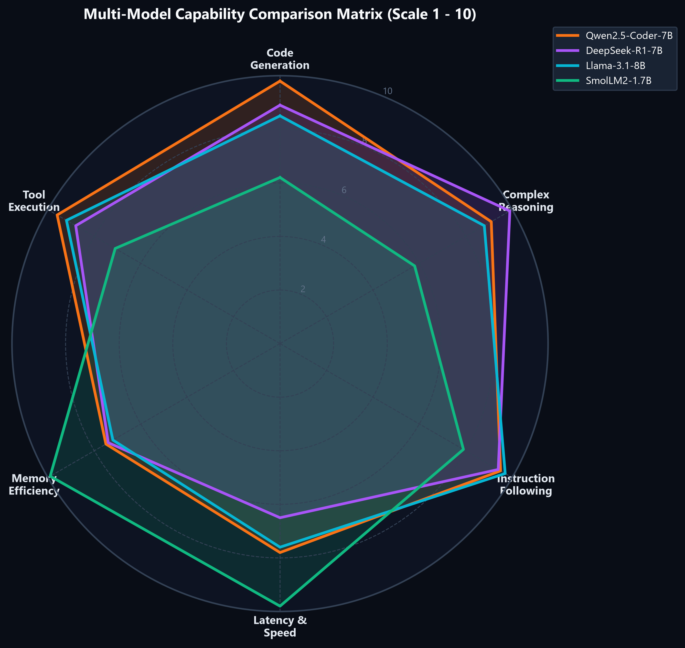

# Model Selection & Orchestration Topology

## 🧠 Local Model Architecture Strategy

**C.O.P.P.E.R.** is engineered for high-performance offline inference on modern consumer hardware (AMD Ryzen 9 / NVIDIA RTX 5060 Laptop GPU with 8GB VRAM). 

Instead of running a single monolithic model for all tasks, C.O.P.P.E.R. distributes responsibilities across a **tiered model hierarchy** totaling **26 quantized artifacts (39.50 GB)**.

---

## 📋 Full Model Manifest & Tier Distribution



                                  ┌────────────────────────┐
                                  │   Incoming User Turn   │
                                  └───────────┬────────────┘
                                              │
                                  ┌───────────▼────────────┐
                                  │ Router (Llama-3.2-1B)  │
                                  └───────────┬────────────┘
         ┌──────────────────┬─────────────────┼─────────────────┬──────────────────┐
         │                  │                 │                 │                  │
┌────────▼────────┐ ┌───────▼───────┐ ┌───────▼───────┐ ┌───────▼───────┐ ┌────────▼────────┐
│   Chat / Core   │ │ AXIS (Coding) │ │  Automation   │ │   Research    │ │  Vision Primary  │
│ Llama-3.1 8B    │ │ Qwen2.5 7B    │ │  Mistral 7B   │ │ DeepSeek-R1 7B│ │ Qwen2-VL 7B      │
└────────┬────────┘ └───────┬───────┘ └───────┬───────┘ └───────┬───────┘ └────────┬─────────┘
         │                  │                 │                 │                  │
         └──────────────────┴────────┬────────┴─────────────────┴──────────────────┘
                                     │
                   ┌─────────────────▼─────────────────┐
                   │   14 SPECIALIZED MICRO-SUBAGENTS  │
                   └───────────────────────────────────┘
```

### 1. Primary Core Models (7B – 8B Heavyweights)

| Model Name | Role | File Path | Quantization | Size | VRAM Budget |
| :--- | :--- | :--- | :---: | :---: | :---: |
| **`Meta-Llama-3.1-8B-Instruct`** | Primary Chat & Conversational Companion | `core/` | Q4_K_M | 4.58 GB | ~4.8 GB |
| **`Qwen2.5-Coder-7B-Instruct`** | Software Engineering & Sandbox Code Gen | `core/` | Q4_K_M | 4.36 GB | ~4.6 GB |
| **`Mistral-7B-Instruct-v0.3`** | Desktop OS Automation & Execution | `core/` | Q4_K_M | 4.07 GB | ~4.3 GB |
| **`DeepSeek-R1-Distill-Qwen-7B`** | Deep Reasoning & Research Synthesis | `core/` | Q4_K_M | 4.36 GB | ~4.6 GB |

---

### 2. Multimodal Vision Models (2B & 7B)

| Model Name | Role | File Path | Quantization | Size | Purpose |
| :--- | :--- | :--- | :---: | :---: | :--- |
| **`Qwen2-VL-7B-Instruct`** | High-Res Vision & Diagram Reasoner | `vision/` | Q4_K_M | 4.36 GB | Full screenshot parsing, UI layout analysis, architectural diagrams |
| **`Qwen2-VL-2B-Instruct`** | Rapid UI Bounding Box & OCR Tagger | `vision/` | Q4_K_M | 940 MB | Fast OCR extraction and button coordinate localization |

---

### 3. Specialized Micro-Subagents (360M – 3B)

| Micro-Agent | Model Architecture | Quantization | Size | Function |
| :--- | :--- | :---: | :---: | :--- |
| **`router`** | `Llama-3.2-1B-Instruct` | Q4_K_M | 770 MB | Fallback sub-40ms user intent classifier |
| **`guardian`** | `Llama-3.2-3B-Instruct` | Q4_K_M | 1.88 GB | Safety verification & conflict detection |
| **`firewall`** | `Qwen2.5-0.5B-Instruct` | Q4_K_M | 379 MB | PII masking & credential filtering |
| **`memory`** | `SmolLM2-1.7B-Instruct` | Q4_K_M | 1.00 GB | Epistemic fact & hypothesis extractor |
| **`summarizer`** | `Qwen2.5-1.5B-Instruct` | Q4_K_M | 940 MB | Context window chunk compression |
| **`coding_linter`** | `Qwen2.5-Coder-0.5B-Instruct` | Q4_K_M | 379 MB | Instant AST syntax error detection |
| **`coding_micro`** | `Qwen2.5-Coder-1.5B-Instruct` | Q4_K_M | 940 MB | Unit test & docstring generation |
| **`shell_safety`** | `Qwen2.5-Coder-3B-Instruct` | Q4_K_M | 1.80 GB | Shell command flag validator |
| **`diagnostics`** | `DeepSeek-R1-Distill-1.5B` | Q4_K_M | 1.04 GB | Stack trace analysis & self-healing |
| **`schema`** | `gemma-2-2b-it` | Q4_K_M | 1.59 GB | JSON schema normalizer |
| **`sql`** | `granite-3.1-2b-instruct` | Q4_K_M | 1.44 GB | Parameterized SQL query generator |
| **`git`** | `SmolLM2-360M-Instruct` | Q4_K_M | 258 MB | Git diff analyzer & commit author |
| **`planner`** | `Falcon3-3B-Instruct` | Q4_K_M | 1.87 GB | Goal decomposer & milestone roadmap |
| **`search`** | `Qwen2.5-3B-Instruct` | Q4_K_M | 1.80 GB | Search query optimizer & verifier |

---

### 4. Audio & Vector Embeddings

| Purpose | Model / Engine | Quantization / Format | Size |
| :--- | :--- | :---: | :---: |
| **Vector Memory** | `nomic-embed-text-v1.5` | Q4_K_M (8192 context) | 80 MB |
| **Speech-to-Text** | Whisper (`tiny.en`, `base.en`, `small`) | GGML Binary | 680 MB total |
| **Text-to-Speech** | Piper ONNX (`amy`, `ryan`) | ONNX Float16 | 120 MB total |
